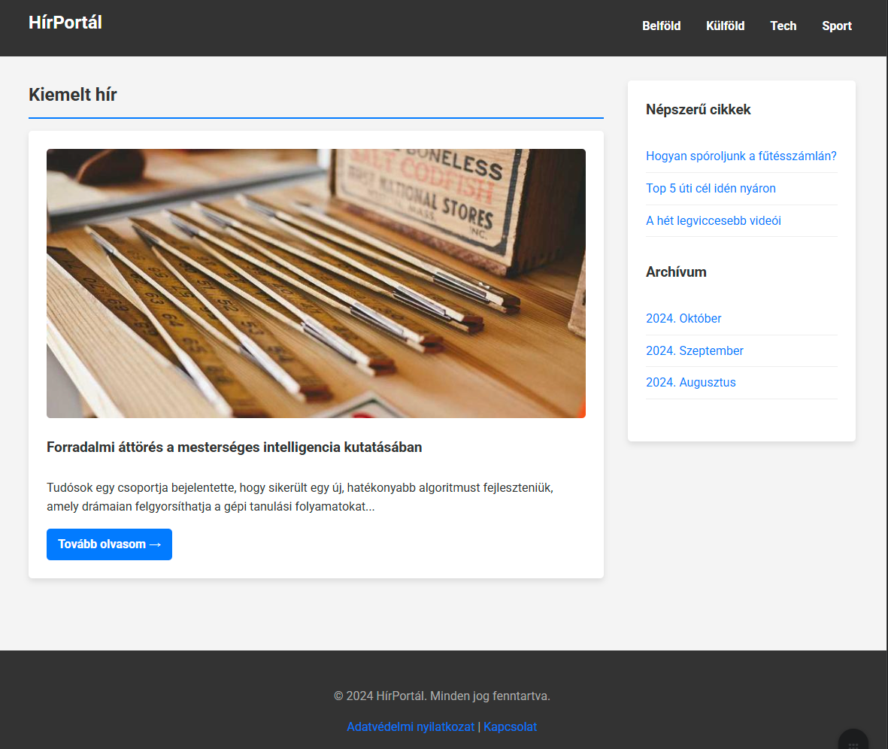

# **Informatika és IT architektúra alapjai**
## 2. előadás

Gazdaságinformatikus BSc
2025/2026/1. félév

---

## Agenda

- 🏗️ **Szemantikus HTML5 struktúra**
- 📊 **Táblázatok és adatmegjelenítés**
- 🔄 **Verziókezelés alapok**  
- 💻 **Git és GitHub**
- 🎨 **VS Code integráció**

---

# **1. rész**
## Szemantikus oldalstruktúra

---


---

## Tipikus weboldal részei

- **Fejléc** → Logó, főcím
- **Navigáció** → Menü, linkek
- **Főtartalom** → Egyedi tartalom
- **Oldalsáv** → Kiegészítő infók
- **Lábléc** → Copyright, kontakt

---

## HTML5 strukturális elemek

### **Szemantikus tagek**
- `<header>` → Fejléc
- `<nav>` → Navigáció
- `<main>` → Főtartalom
- `<article>` → Önálló tartalom
- `<section>` → Tematikus csoport
- `<aside>` → Kapcsolódó tartalom
- `<footer>` → Lábléc

---

## Header és Nav

```html
<header>
  <h1>HírPortál</h1>
</header>

<nav>
  <ul>
    <li><a href="#">Belföld</a></li>
    <li><a href="#">Tech</a></li>
  </ul>
</nav>
```

---

## Main és Article

```html
<main>
  <article>
    <h2>Cikk címe</h2>
    <p>Tartalom...</p>
  </article>
</main>
```

### 📌 **Fontos:** Csak egy `<main>` lehet oldalanként!

---

## Section vs Article

<div class="columns">
<div>

### **Article**
- Önálló egység
- Blogpost, hír
- Máshol is értelmes

</div>
<div>

### **Section**
- Tematikus csoport
- Fejezet, rész
- Címsorral kezdődik

</div>
</div>

---

## Aside és Footer

```html
<aside>
  <h3>Kapcsolódó</h3>
  <ul>...</ul>
</aside>

<footer>
  <p>&copy; 2025</p>
</footer>
```

---

## Nem szemantikus elemek

### **`<div>` és `<span>`**

- `<div>` → Blokk konténer
- `<span>` → Inline konténer

### ⚠️ **Csak akkor, ha nincs jobb!**

---

## Miért fontos a szemantika?

- ✅ **SEO optimalizálás**
- ✅ **Akadálymentesség** 
- ✅ **Kód olvashatóság**
- ✅ **Karbantarthatóság**

---

# **2. rész**
## Táblázatok

---

## 🤔 Mire valók a táblázatok?

> **Táblázatos adatok megjelenítése**
> 
> ❌ NEM weboldal elrendezésre!

---

## Alapvető elemek

```html
<table>
  <tr>
    <td>Cella 1</td>
    <td>Cella 2</td>
  </tr>
</table>
```

- `<table>` → Táblázat
- `<tr>` → Sor (table row)
- `<td>` → Cella (table data)

---

## Fejlécek hozzáadása

```html
<table>
  <tr>
    <th>Név</th>
    <th>Kor</th>
  </tr>
  <tr>
    <td>Anna</td>
    <td>32</td>
  </tr>
</table>
```

### `<th>` → Table header

---

## Cellák összevonása

### **Colspan** → Oszlopok átfogása
```html
<th colspan="2">Teljes név</th>
```

### **Rowspan** → Sorok átfogása
```html
<td rowspan="3">Közös</td>
```

---

## Táblázat strukturálása

```html
<table>
  <caption>Havi kiadások</caption>
  <thead>
    <tr><th>Tétel</th></tr>
  </thead>
  <tbody>
    <tr><td>Lakbér</td></tr>
  </tbody>
  <tfoot>
    <tr><td>Összesen</td></tr>
  </tfoot>
</table>
```

---

## Struktúra részei

- `<caption>` → Táblázatcím
- `<thead>` → Fejléc rész
- `<tbody>` → Törzs rész
- `<tfoot>` → Lábléc rész

### 💡 Sorrend: thead → tbody → tfoot

---

# **3. rész**
## Verziókezelés alapjai

---

## 🤔 A probléma

**Ismerős fájlnevek?**
- beadando_v1.txt
- beadando_v2.txt
- beadando_vegleges.txt
- beadando_TENYLEG_vegleges.txt
- beadando_TENYLEG_vegleges_javitott.txt

---

## Mi a verziókezelés?

### **Problémák megoldása:**
- ✅ Változások követése
- ✅ Korábbi verziók visszaállítása
- ✅ Párhuzamos munka
- ✅ Ki, mikor, mit módosított

---

## Verziókezelő típusok

<div class="columns">
<div>

### **Központosított**
- Egy központi szerver
- SVN, CVS
- Szerverfüggő

</div>
<div>

### **Elosztott**
- Teljes másolat mindenhol
- **Git**, Mercurial
- Offline működés

</div>
</div>

---

## Git alapfogalmak

- **Repository** → Projekt tároló
- **Commit** → Mentési pont
- **Branch** → Fejlesztési ág
- **Stage** → Előkészítés

---

# **4. rész**
## Git és VS Code

---

## Telepítés és konfiguráció

### **1. Git telepítése**
[git-scm.com](https://git-scm.com)

### **2. Beállítás** (egyszer kell)
```bash
git config --global user.name "Neved"
git config --global user.email "email@cim.hu"
```

---

## VS Code Git integráció

### **Source Control panel**
- Bal oldali ikon (elágazás)
- Vizuális Git kezelés
- Nincs szükség terminálra

---

## Repository létrehozása

1. **Mappa megnyitása** VS Code-ban
2. **Source Control** panel
3. **Initialize Repository** gomb
4. Kész! 🎉

---

## Git munkafolyamat

### **Három lépés:**
1. **Módosítás** → Fájlok szerkesztése
2. **Stage** → Változások előkészítése (+)
3. **Commit** → Mentés üzenettel

---

## 💻 Gyakorlat

**Első commit készítése:**

1. Új fájl létrehozása
2. Stage Changes (+)
3. Commit üzenet írása
4. Commit gomb

---

# **5. rész**
## GitHub

---

## Mi az a GitHub?

### **Git + Felhő**
- Online repository tároló
- Együttműködési platform
- Biztonsági mentés
- Portfolio

---

## GitHub publikálás

### **VS Code-ból egyszerűen:**
1. **Publish to GitHub** gomb
2. Bejelentkezés
3. Privát vagy nyilvános?
4. Automatikus feltöltés

---

## Szinkronizálás

### **Sync Changes**
- Feltöltés (Push)
- Letöltés (Pull)
- Egy gombnyomás

### 📌 Bal alsó sarok a VS Code-ban

---

## GitHub előnyök

- ✅ **Bárhonnan elérhető**
- ✅ **Együttműködés**
- ✅ **Verziókövetés**
- ✅ **Portfolio építés**

---

## Összefoglalás

### **Ma megtanultuk:**
- 🏗️ Szemantikus HTML struktúra
- 📊 Táblázatok helyes használata
- 🔄 Verziókezelés fontossága
- 💻 Git alapok VS Code-dal
- 🌐 GitHub használata