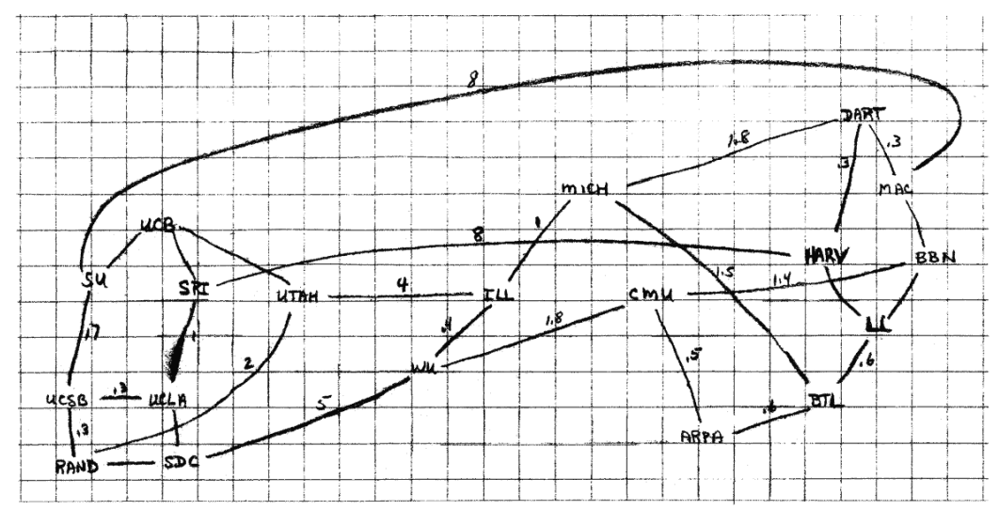
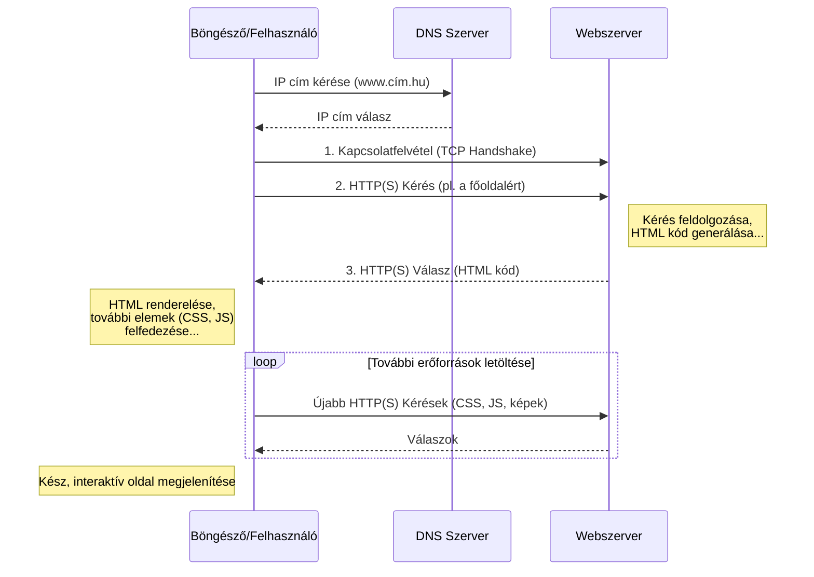

# Hogyan működik a web?

A 21. századi gazdaság és társadalom működése elképzelhetetlen az Internet és a rajta futó szolgáltatások, különösen a World Wide Web nélkül. Egy gazdaságinformatikus számára, aki a technológia és az üzleti folyamatok metszéspontjában tevékenykedik, ezen ökoszisztéma mélyreható ismerete nem csupán előny, hanem alapvető követelmény. Ez a fejezet arra vállalkozik, hogy egy tömör összefoglaló képet fessen az Internetről és a World Wide Web-ről, bemutatva azok technológiai alapjait.

## **1.1. Az Internet és a World Wide Web**

Az **Internet** egy globális, összekapcsolt számítógép-hálózatokból álló rendszer, a fizikai és logikai infrastruktúra, amely lehetővé teszi az adatok cseréjét a világ különböző pontjai között. Ez a "hálózatok hálózata", amely kábelek, rádióhullámok és műholdak segítségével köti össze az eszközöket. Ezzel szemben a **World Wide Web** (WWW vagy Web) egy információs rendszer, amely az Interneten működik. Ez egy globális gyűjteménye a hiperhivatkozásokkal összekötött dokumentumoknak és egyéb erőforrásoknak, amelyeket webböngészők segítségével érhetünk el. Míg az Internet maga az infrastruktúra, a Web csupán egy – bár kétségtelenül a legnépszerűbb – szolgáltatás, amely ezen az infrastruktúrán fut, az e-mail, az online játékok vagy a fájlátvitel (FTP) mellett. Ez a megkülönböztetés alapvető, hiszen más üzleti modellek és technológiai megoldások épülnek a puszta hálózati kapcsolatra (Internet), és mások a webes tartalommegosztásra (WWW).

## **1.2. Az Internet fejlődésének mérföldkövei**

Az Internet története a hidegháborús fegyverkezési verseny idejére nyúlik vissza. Az 1960-as években az Egyesült Államok Védelmi Minisztériuma egy olyan kommunikációs rendszert akart létrehozni, amely egy esetleges atomcsapás után is működőképes marad. A kulcs a **decentralizáció** volt: egy olyan hálózat, amelynek nincs egyetlen központi, sebezhető pontja.

**Kulcsfontosságú mérföldkövek:**

* **1969 – ARPANET:** Az Advanced Research Projects Agency (ARPA) elindítja az ARPANET-et, amely kezdetben négy amerikai kutatási központot: a Kaliforniai Egyetemet Los Angelesben (UCLA), a Stanford Kutatóintézetet (SRI), a Kaliforniai Egyetemet Santa Barbarán (UCSB) és a Utahi Egyetemet kötött össze. A rendszer forradalmi újítása a **csomagkapcsolt adatátvitel** volt. A korábbi vonalkapcsolt (mint a hagyományos telefon) hálózatokkal ellentétben itt az adatokat kisebb csomagokra bontották, amelyeket egyenként címeztek meg és küldtek el a hálózaton. Ezek a csomagok akár különböző útvonalakon is haladhattak, és a célállomáson álltak újra össze. Ez a rugalmasság biztosította a hálózat túlélőképességét.  
* **1983 – A TCP/IP megszületése:** Az ARPANET hivatalosan is átáll a TCP/IP protokollkészletre, amely egységesítette a különböző hálózatok közötti kommunikációt. 1983\. január 1-jét tekintjük a modern Internet születésnapjának, mivel ez tette lehetővé a "hálózatok hálózatának" (Inter-net) létrejöttét. (A protokoll definíciója lentebb.)
* **1989-1991 – A World Wide Web Forradalma:** A svájci CERN részecskefizikai kutatóközpontban dolgozó brit tudós, **Tim Berners-Lee** egy olyan rendszert javasolt, amely megkönnyíti a kutatók számára az információk megosztását. A Web alapjait három kulcsfontosságú technológia és egy szoftvercsomag megalkotásával fektette le:  
  * **HTML (HyperText Markup Language):** Egy egyszerű leírónyelv a dokumentumok *létrehozására*.  
  * **URL (Uniform Resource Locator):** Egy egységes címzési rendszer a webes tartalmak *azonosítására*.  
  * **HTTP (Hypertext Transfer Protocol):** Egy protokoll a webes tartalmak *lekérésére* és *továbbítására*.  
  * Az első **böngésző** és **webszerver** szoftver.

Berners-Lee víziója egy nyílt, bárki által használható és bővíthető információs teret hozott létre. A felhasználóbarát, grafikus böngészők megjelenésével a Web kilépett az akadémiai körökből, és a '90-es évek közepétől megkezdte világhódító útját, amely alapjaiban formálta át a kommunikációt, a kereskedelmet és a társadalmat.

## **1.3. A kommunikáció nyelve: protokollok**

A **protokoll** egy szabály- és szabványgyűjtemény, amely leírja a hálózati kommunikáció résztvevőinek viselkedését. Olyan, mint egy diplomáciai protokoll vagy egy nyelvtani szabályrendszer: biztosítja, hogy a felek megértsék egymást és az interakció rendezett keretek között folyjon.

* **A TCP/IP Protokollcsalád:** Ez az internetes kommunikáció alapja. Képzeljük el, hogy egy vastag könyvet akarunk elküldeni postán. Nem tesszük be egy óriási borítékba, hanem szétszedjük lapokra.  
  1. **TCP (Transmission Control Protocol):** A "gondos postai ügyintéző". Fogja a könyvet (az adatot), lapokra (csomagokra) szedi, megszámozza minden lapot, majd külön borítékba teszi őket. A címzettnél ellenőrzi, hogy minden lap megérkezett-e, és a sorszámok alapján újra összerakja a könyvet. Ha egy lap elvész, kéri annak újraküldését. Ez biztosítja a **megbízható, sorrendhelyes adatátvitelt**.  
  2. **IP (Internet Protocol):** A "postás". Minden borítékra (csomagra) ráírja a feladó és a címzett címét (IP-cím). Az IP protokoll feladata, hogy a csomagokat eljuttassa a célállomásra a hálózat útvesztőin keresztül, de nem garantálja sem a sorrendet, sem a sikeres kézbesítést. <a href="#fn1" class="footnote-ref">1</a>

A két protokoll együttműködése (TCP/IP) biztosítja, hogy az adatok megbízhatóan és a helyes sorrendben érkezzenek meg a célba.

## **1.4. A kliens-szerver modell**

Ahhoz, hogy megértsük, hogyan működik a Web (és számos más internetes szolgáltatás), ismernünk kell a **kliens-szerver modellt**. Ez a modell két fő szereplőre épül, amelyek meghatározott feladatokat látnak el.

A **kliens** (client): Az "ügyfél" vagy kérelmező. Ez egy szoftver vagy eszköz (például a számítógépünkön futó webböngésző, egy mobilalkalmazás vagy egy e-mail program), amely egy szolgáltatást vagy adatot szeretne elérni. A kliens feladata, hogy elindítsa a kommunikációt egy kérés (request) elküldésével.

A **szerver** (server): A "kiszolgáló". Ez egy nagy teljesítményű, folyamatosan elérhető számítógép, amely arra vár, hogy a kliensektől kérések érkezzenek. Amikor egy kérés beérkezik, a szerver feldolgozza azt (pl. megkeres egy fájlt, lekérdez egy adatbázist), majd egy válasszal (response) felel a kliensnek. Egyetlen szerver egyszerre több ezer klienst is kiszolgálhat.

Ez a modell számos előnnyel jár:
- **Központosított menedzsment**: Az adatok és az alkalmazáslogika a szerveren található, ami megkönnyíti a karbantartást, a frissítéseket és a biztonsági mentéseket.
- **Skálázhatóság**: A szerver erőforrásai (hardver, sávszélesség) bővíthetők a növekvő kliensigények kiszolgálására anélkül, hogy a kliens oldalon változtatásra lenne szükség.
- **Erőforrás-megosztás**: Egy szerver egyszerre több ezer vagy millió klienst is kiszolgálhat.

## **1.5. A kapu a webre: a böngésző**

A böngésző egy olyan kliensalkalmazás, amelynek célja a World Wide Weben található információk elérése és megjelenítése a felhasználó számára. Fő feladatai a következők:

- **Kérések indítása**: Amikor a felhasználó beír egy webcímet (URL-t) vagy rákattint egy linkre, a böngésző egy HTTP kérést állít össze és küld el a megfelelő szervernek.
- **Válaszok fogadása**: Fogadja a szerver által küldött választ, amely leggyakrabban HTML, CSS és JavaScript kódból, valamint képekből és egyéb erőforrásokból áll.
- **Renderelés**: Ez a böngésző legfontosabb "mágiája". A kapott forráskódokat (amelyek önmagukban csak szöveges fájlok) értelmezi, és egy vizuálisan egységes, interaktív, olvasható weboldallá alakítja ("rendereli") a felhasználó képernyőjén.
- **Interakció kezelése**: Kezeli a felhasználói műveleteket, például a gombokra kattintást, az űrlapok kitöltését és az újabb kérések elindítását.

A legismertebb böngészők a Google Chrome, a Mozilla Firefox, a Microsoft Edge és az Apple Safari. Bár a működési elvük azonos, renderelő motorjaikban és funkcióikban eltérhetnek.

Érdekes statisztikák: [w3schools.com](https://www.w3schools.com/browsers/), [gemiusRanking](https://ranking.gemius.com/hu/)

### **1.6. Egy weboldal betöltődésének folyamata**

Egyetlen Enter leütése a böngészőben egy mindennapos mozdulat, amely mögött azonban egy villámgyors és megfelelően koreografált digitális eseménysorozat rejlik. Nézzük meg lépésről lépésre, mi történik a kulisszák mögött\!

1. **Névfeloldás (DNS):** A felhasználó beírja: www.uni-corvinus.hu. A számítógépek nem neveket, hanem számokból álló IP-címeket használnak (pl. 146.110.3.100). A böngésző első dolga, hogy "lefordítsa" a domain nevet IP-címre. Ezt a feladatot a **DNS (Domain Name System)**, az internet globális telefonkönyve végzi el. A böngésző megkérdezi a legközelebbi DNS-szervert, amely vagy tudja a választ, vagy továbbkérdez más szerverektől, amíg meg nem találja a helyes IP-címet.  
2. **Kapcsolatfelvétel (TCP Handshake):** A böngésző a megszerzett IP-cím segítségével egy háromlépéses TCP "kézfogást" (handshake) kezdeményez a Corvinus Egyetem webszerverével, hogy egy stabil kommunikációs csatornát építsen ki.  
3. **A Kérés (HTTP/HTTPS Request):** A csatorna felépülése után a böngésző (a kliens) egy **HTTP kérést** küld a szervernek. Ez egy egyszerű szöveges üzenet, amely tartalmazza a kérés legfontosabb adatait.  
   * **GET / HTTP/1.1**: A kérés sora, amely tartalmazza a metódust (GET \- adatot kérek), az elérési utat (/ \- a weboldal gyökere, azaz a főoldal), és a protokoll verzióját.  
   * **Host: www.uni-corvinus.hu**: A célhoszt, vagyis melyik weboldalt keressük ezen az IP-címen (egy szerver több weboldalt is kiszolgálhat).  
   * **Egyéb fejlécek:** Információk a böngészőről, az elfogadott formátumokról stb.  
4. **Szerver oldali feldolgozás:** A szerver fogadja és értelmezi a kérést. Megkeresi a kért erőforrást (pl. a főoldal HTML fájlját), vagy ha az oldal dinamikus, lefuttat egy programot, amely legenerálja a HTML kódot.  
5. **A Válasz (HTTP/HTTPS Response):** A szerver egy **HTTP válasszal** felel, amely szintén szöveges.  
   * **HTTP/1.1 200 OK**: Az állapot sor, amely jelzi a protokoll verzióját és a kérés sikerességét (200 OK). Más kódok hibát jelezhetnek (pl. 404 Not Found \- a kért erőforrás nem található).  
   * **Fejlécek:** Információk a válaszról, pl. a tartalom típusa (Content-Type: text/html), a szerver típusa, a dátum.  
   * **A Törzs (Body):** A válasz "rakománya", ebben az esetben maga a weboldal HTML kódja.  
6. **Renderelés:** A böngésző megkapja a HTML kódot, és elkezdi felépíteni az oldal vázát. A HTML elemzése közben újabb hivatkozásokat találhat (pl. CSS stíluslapokra, JavaScript fájlokra, képekre). Mindegyikre újabb HTTP kérést indít, letölti őket, majd a HTML, CSS és JavaScript alapján felrajzolja (rendereli) a kész, interaktív weboldalt a képernyőre.

> [!NOTE]
> **A HTTPS és a digitális bizalom**
> 
> A HTTPS (Hypertext Transfer Protocol Secure) ugyanazt a folyamatot hajtja végre, de egy titkosítási réteget (SSL/TLS) ad hozzá. A TCP kézfogás után a böngésző és a szerver egy bonyolult kriptográfiai eljárással megegyezik egy titkos kulcsban. Innentől kezdve minden közöttük zajló kommunikáció ezzel a kulccsal van titkosítva. Ez biztosítja, hogy:
> 1. **Titkosítás:** Külső fél nem tudja elolvasni az adatokat (pl. egy bankkártyaadatot).  
> 2. **Integritás:** Az adatokat útközben nem lehet észrevétlenül módosítani.  
> 3. **Hitelesítés:** A böngésző a szerver tanúsítványa alapján meggyőződhet róla, hogy valóban azzal a szerverrel kommunikál, akinek az kiadja magát.

## **1.7 Ellenőrző kérdések**

1. Fogalmazza meg saját szavaival a legfontosabb különbséget az Internet és a World Wide Web között\! Mondjon példát két olyan internetes szolgáltatásra, amely nem része a Webnek\!  
2. Mi volt a csomagkapcsolt adatátvitel legfőbb előnye a vonalkapcsolttal szemben a kezdeti ARPANET kontextusában?  
3. Milyen három alapvető technológiát köszönhetünk Tim Berners-Lee-nek, amelyek a Web alapjait képezik?  
4. Magyarázza el a TCP és az IP protokollok közötti munkamegosztást egy Ön által választott analógiával\!  
5. Mi a DNS rendszer szerepe egy weboldal betöltődése során? Miért van rá szükség?  
6. Milyen plusz biztonsági garanciákat nyújt a HTTPS a sima HTTP-hez képest? Miért elengedhetetlen ez egy webáruház esetében?

🌐

<ol>
<li id="fn1">
IPv4 vs. IPv6: Az eredeti, 1983-ban bevezetett IPv4 protokoll körülbelül 4.3 milliárd egyedi címet tesz lehetővé. Ez a szám onnan ered, hogy az IPv4-címek 32 bites számsorok. A számítástechnikában egy bitnek két lehetséges értéke lehet (0 vagy 1). Így a lehetséges kombinációk száma 2 a 32. hatványon. Ez a szám a 2010-es évekre kimerült az internetre csatlakozó eszközök robbanásszerű növekedése miatt. A megoldást az IPv6 jelenti, amely egy sokkal nagyobb címtartományt biztosít (2^128), ezzel hosszú távon garantálva az Internet bővülését.
<a href="#fnref1" class="footnote-backref">&#8617;</a>
</li>
</ol>

Forrás: https://resilientwebdesign.com/

A szöveg AI felhasználásával készült.