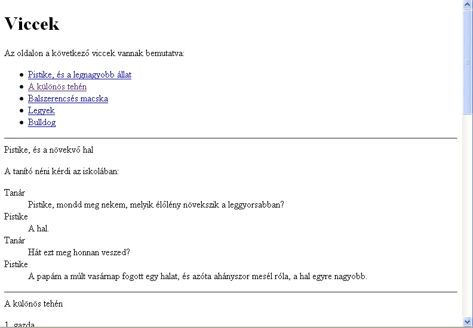
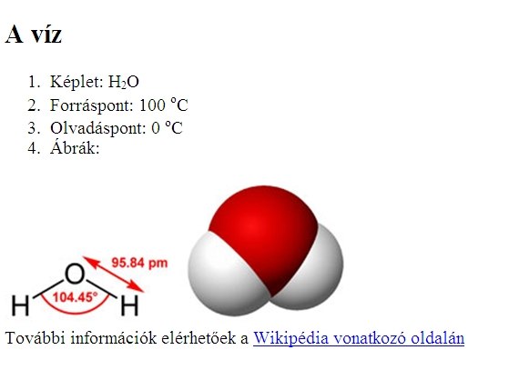
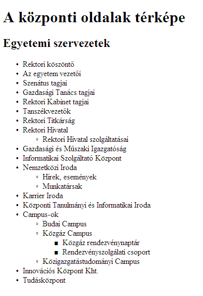

# Gyakorló feladatok (HTML)

Valamennyi feladat megoldását ellenőrizzük 1) vizuálisan böngésző segítségével, valamint 2) [HTML validátor](https://https://validator.w3.org/) segítségével.

## Viccek

**Feladat**: Készítsd el az ábrán látható weboldalt, ami 5 viccet tartalmaz. A szöveget a [vicc.txt](./viccek/vicc.txt) fájlban találhatod meg. Ügyelj arra, hogy az elején lévő felsorolás elemeire kattintva az oldal a kiválasztott vicchez ugorjon. Minden vicc címe külön bekezdésben legyen (alul)!

<!--[Megoldás](./viccek/viccek-megoldas.html)-->

## A víz

Valósítsd meg a képen látható weboldalt HTML segítségével. A szöveget a [viz.txt](./viz/viz.txt) fájlban találhatod meg. A szükséges képek: [viz2d.jpg](./viz/viz2d.jpg) és [viz3d.jpg](./viz/viz3d.jpg). A weboldal végén található link a [http://hu.wikipedia.org/wiki/Víz](http://hu.wikipedia.org/wiki/Víz) oldalra vezessen!

<!--[Megoldás](./viz/viz-megoldas.html)-->

## Egyetemi szervezetek

Valósítsd meg a képen látható weboldalt beágyazott listák segítségével. A szöveget a [lista.txt](./egyetem/lista.txt) fájlban találhatod meg. (Megjegyzés: azt, hogy hogyan tudjuk megadni a listák jelölő típusait a későbbikeben tanuljuk meg, egyelőre automatikusan állítódik be.)

<!--[Megoldás](./egyetem/egyetem-megoldas.html)-->