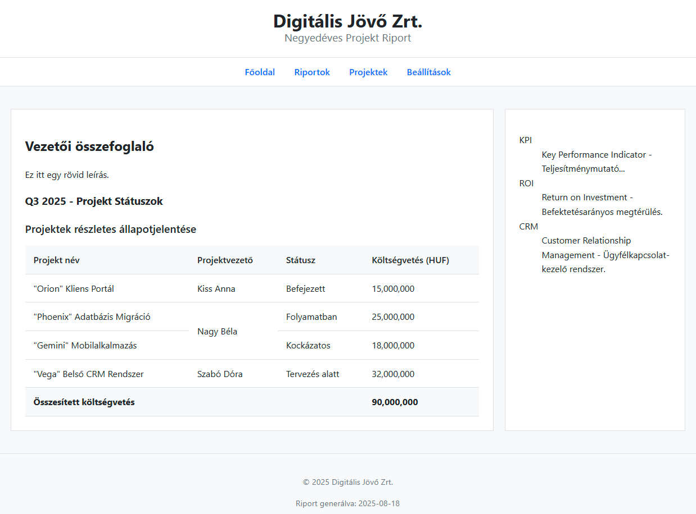

# HTML Projekt Riport készítése

## Célkitűzés
Egy szemantikus HTML oldal létrehozása (`projekt_riport.html`), amely egy projekt riportot jelenít meg táblázattal és kiegészítő információkkal.

## CSS fájl beillesztése
Mivel még nem tanultunk CSS-t, de szeretnénk formázott oldalt látni, használjunk egy előre elkészített stílusfájlt. Töltsd le a [stilus.css](./stilus.css) fájlt ugyanabba a mappába, ahol a HTML fájlod lesz!

A CSS fájlt így kapcsold a HTML-hez a `<head>` részben:
```html
<link rel="stylesheet" href="stilus.css">
```
Ez a sor azt mondja a böngészőnek, hogy töltse be a `stilus.css` fájlt és alkalmazza a benne lévő formázásokat.



---

## Alapstruktúra felépítése

Hozd létre a `projekt_riport.html` fájlt! Építsd fel az alábbi hierarchiát:

```
html (lang="hu")
├── head
│   ├── meta (charset="UTF-8")
│   ├── title (megfelelő cím)
│   └── link (rel="stylesheet" href="stilus.css")
└── body
    ├── header
    ├── nav
    ├── main
    │   ├── article
    │   └── aside
    └── footer
```

**Fontos:** 
- Ne felejtsd el a `<!DOCTYPE html>` deklarációt a fájl elején!
- A CSS kapcsolódás nélkül az oldal formázatlan marad

---

## Tartalom hozzáadása

### Header
- Cég neve: "Digitális Jövő Zrt." (`<h1>`)
- Alcím: "Negyedéves Projekt Riport" (`<h2>`)

### Navigáció
Készíts egy listát 4 linkkel:
- Főoldal
- Riportok  
- Projektek
- Beállítások

Nem fogjuk ezeket a menüpontokat ténylegesen használni, ezért a linkek erre a dokumentumra mutatnak majd `href=#` attribútum beállításával.

### Main - Article szekció
Az `<article>` elembe kerül:
1. **Címsor**: "Vezetői összefoglaló" (`<h2>`)
2. **Bevezető bekezdés**: Rövid leírás a riport tartalmáról (Q3 eredmények, projektek állapota)
3. **Másodlagos cím**: "Q3 2025 - Projekt Státuszok" (`<h3>`)
4. **Táblázat** (lásd következő lépés)

### Main - Aside szekció
Készíts egy "Kulcsfogalmak" című (`<h3>`) definíciós listát:
```html
<dl>
    <dt>KPI</dt>
    <dd>Key Performance Indicator - Teljesítménymutató...</dd>
    <dt>ROI</dt>
    <dd>Return on Investment - Befektetésarányos megtérülés.</dd>
    <dt>CRM</dt>
    <dd>Customer Relationship Management - Ügyfélkapcsolat-kezelő rendszer.</dd>
</dl>
```

### Footer
- Copyright szöveg: "© 2025 Digitális Jövő Zrt."
- Generálási dátum: "Riport generálva: 2025-08-18"

---

## Táblázat megépítése

Az `<article>` elemen belül készíts táblázatot "Projektek részletes állapotjelentése" címmel.

### Követelmények:
- Használd a megfelelő szemantikus elemeket a cím megadásához
- A táblázat legyen szerkezetileg tagolt (fejléc, törzs, lábléc)
- **Fejléc oszlopok**: Projekt Név, Projektvezető, Státusz, Költségvetés (HUF)
- **Adatok** (ebben a sorrendben):
  1. "Orion" Kliens Portál | Kiss Anna | Befejezett | 15,000,000
  2. "Phoenix" Adatbázis Migráció | Nagy Béla | Folyamatban | 25,000,000  
  3. "Gemini" Mobilalkalmazás | Nagy Béla | Kockázatos | 18,000,000
  4. "Vega" Belső CRM Rendszer | Szabó Dóra | Tervezés alatt | 32,000,000
- **Lábléc**: Összesített költségvetés sor 90,000,000 összeggel

### Speciális feladatok:
- **Függőleges cellaösszevonás**: Nagy Béla két projektet is vezet - a neve csak egyszer jelenjen meg!
- **Vízszintes cellaösszevonás**: A láblécben az "Összesített költségvetés" felirat és az összeg megfelelően oszoljon el

---

## Ellenőrzési lista

- [ ] DOCTYPE deklaráció megvan?
- [ ] CSS fájl megfelelően hivatkozva?
- [ ] Minden szemantikus elem a helyén? (header, nav, main, article, aside, footer)
- [ ] Navigációs lista linkekkel elkészült?
- [ ] Táblázat címe megfelelő elemmel megadva?
- [ ] Táblázat szerkezeti tagolása kész? (fejléc, törzs, lábléc)
- [ ] Nagy Béla neve csak egyszer jelenik meg (cellaösszevonás)?
- [ ] Lábléc cellaösszevonása működik?
- [ ] Copyright szimbólum (`&copy;`) használva?

---

## Megoldás feltöltése
Töltsd fel a kész `projekt_riport.html` fájlt GitHub profilodra.

**Tipp:** Ha valami nem jelenik meg megfelelően, először a HTML struktúrát ellenőrizd - minden elem megfelelően be van zárva?