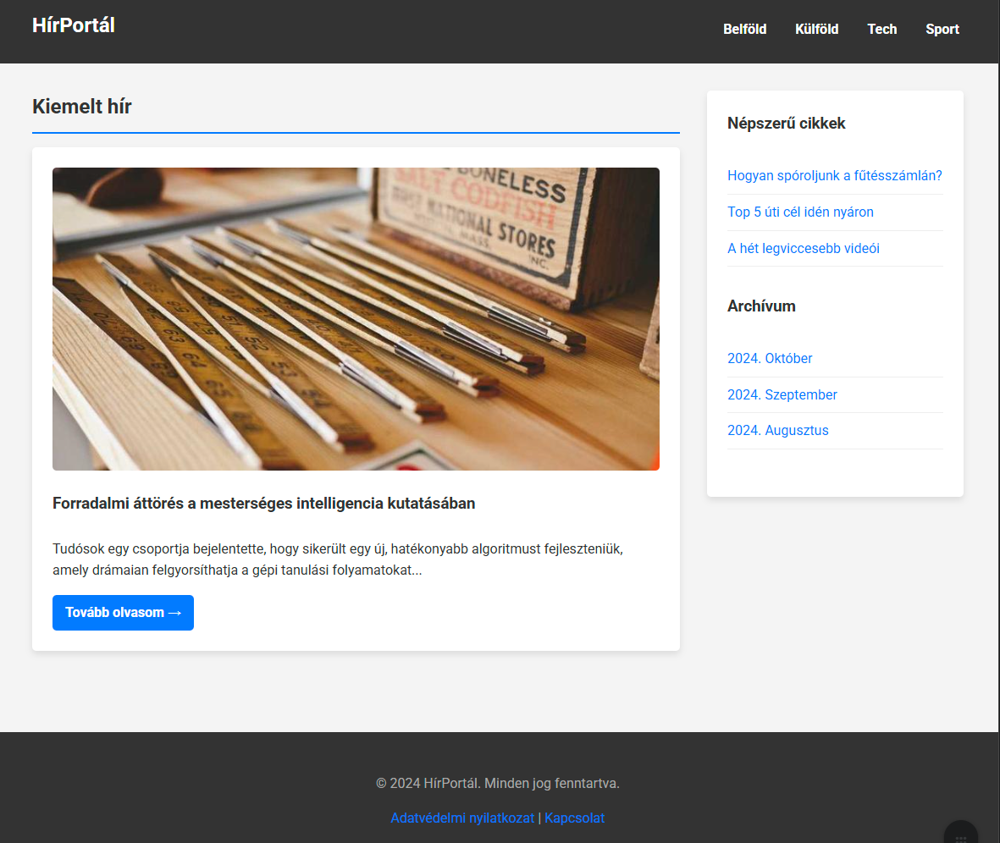

# Szemantikus oldalstruktúra

Az előző héten megismertük a HTML alapvető építőköveit: az elemeket, attribútumokat, címsorokat, bekezdéseket, listákat és linkeket. Ezekkel már képesek vagyunk egyszerűbb dokumentumokat létrehozni. Ezen a héten egy lépéssel tovább megyünk, és megnézzük, hogyan adhatunk a weboldalainknak egy magasabb szintű, szemantikus struktúrát, valamint hogyan jeleníthetünk meg komplex, táblázatos adatokat.

## A weboldal elrendezése: Szemantikus struktúra

A legtöbb weboldal, bár vizuálisan eltérő lehet, általában hasonló fő részekből áll. Gondoljunk csak egy tipikus hírportálra vagy egy céges bemutatkozó oldalra. A HTML5 bevezetett egy sor új, **szemantikus elemet**, amelyekkel pontosan leírhatjuk ezeket a logikai egységeket. Ezek használata nemcsak a kódunkat teszi olvashatóbbá, de kritikus fontosságú az **akadálymentesítés** (pl. képernyőolvasó szoftverek számára) és a **keresőoptimalizálás (SEO)** szempontjából is.

Egy tipikus weboldal főbb részei a következők:

* **Fejléc (header):** Általában az oldal tetején található sáv, amely a logót, a főcímet és esetleg egy mottót tartalmazza. Ez a rész többnyire minden aloldalon azonos.
* **Navigációs sáv (navigation bar):** A webhely főbb szekcióira mutató linkek gyűjteménye, legtöbbször menüként vagy fülekként megvalósítva. A konzisztens navigáció elengedhetetlen a jó felhasználói élményhez.
* **Főtartalom (main content):** A központi, legnagyobb terület, amely az adott oldal egyedi tartalmát hordozza (pl. egy cikk, egy terméklista, egy videó). Ez az a rész, ami aloldalról aloldalra a leginkább változik.
* **Oldalsáv (sidebar):** Kiegészítő információkat, linkeket, hirdetéseket tartalmazó sáv. Tartalma gyakran kapcsolódik a főtartalomhoz (pl. kapcsolódó cikkek).
* **Lábléc (footer):** Az oldal alján elhelyezkedő sáv, amely általában a copyright információkat, elérhetőséget vagy impresszumot tartalmazza.



>[!TASK]
>Azonosítsd be a weboldal főbb részeit a fenti képen!

### HTML5 strukturális elemek

A HTML5 dedikált tageket biztosít az oldal különböző részeinek a jelölésére.

* `<header>`: Egy bevezető tartalmi csoportot jelöl. Ha a `<body>` közvetlen gyermeke, akkor az oldal globális fejlécét definiálja. Ha egy `<article>` vagy `<section>` elemen belül van, akkor az adott szekció fejlécét jelöli.
* `<nav>`: Az oldal elsődleges navigációs linkjeit tartalmazza. Másodlagos linkcsoportok (pl. egy láblécben) nem feltétlenül tartoznak ide.
* `<main>`: Az oldal központi, egyedi tartalmát foglalja magába. **Egy oldalon csak egy `<main>` elem lehet**, és közvetlenül a `<body>`-ben kell elhelyezkednie.
* `<article>`: Egy önálló, kerek egészet alkotó tartalmi blokkot jelöl, amely a weboldal többi részétől függetlenül is értelmes lenne. Tipikus példa egy blogbejegyzés, egy újságcikk vagy egy fórumhozzászólás.
* `<section>`: Egy tematikus csoportosítást jelöl az oldalon belül, amely egy adott funkcionalitást (pl. térkép, hírek doboz) vagy témát fog össze. Jó gyakorlat minden szekciót egy címsorral (`<h1>`-`<h6>`) kezdeni.
* `<aside>`: Olyan tartalmat jelöl, amely nem szorosan kapcsolódik a főtartalomhoz, de közvetve kiegészítő információt nyújthat (pl. egy szószedet, a szerző életrajza, kapcsolódó linkek).
* `<footer>`: Az oldal vagy egy szekció lezáró tartalmát képviseli.

Az alábbi példa a fenti weboldalhoz hasonló vázat mutat be említett elemekkel:

```html
<!DOCTYPE html>
<html lang="hu">
<head>
    <meta charset="UTF-8">
    <title>HTML5 Oldalstruktúra - Egyszerű Példa</title>
</head>
<body>

    <!-- HEADER: Az oldal teteje, a főcím helye. Minden oldalon megjelenhet. -->
    <header>
      <h1>HírPortál</h1>
    </header>

    <!-- NAV: A fő navigációs linkek gyűjtőhelye. A "navigation" szóból ered. -->
    <nav>
      <ul>
        <li><a href="#">Belföld</a></li>
        <li><a href="#">Külföld</a></li>
        <li><a href="#">Tech</a></li>
        <li><a href="#">Sport</a></li>
      </ul>
    </nav>

    <!-- MAIN: Az oldal fő, egyedi tartalma. Elvileg minden oldalon más. -->
    <main>

      <!-- ARTICLE: Egy önálló, teljes tartalmi egység, mint egy blogbejegyzés vagy egy hír. -->
      <article>
        <h2>Forradalmi áttörés a mesterséges intelligencia kutatásában</h2>
        <p>Tudósok egy csoportja bejelentette, hogy sikerült egy új, hatékonyabb algoritmust fejleszteniük, amely drámaian felgyorsíthatja a gépi tanulási folyamatokat.</p>

        <!-- SECTION: Az article-ön belüli tematikus alfejezet vagy csoport. -->
        <section>
          <h3>A kutatás háttere</h3>
          <p>A most bemutatott algoritmus évek óta tartó kutatómunka eredménye, amely a neurális hálók hatékonyságának növelését célozta.</p>
        </section>

        <section>
          <h3>Jövőbeli kilátások</h3>
          <p>A szakértők szerint az új technológia belátható időn belül a mindennapi életben is megjelenhet, például az önvezető autókban vagy az orvosi diagnosztikában.</p>
        </section>
      </article>

      <!-- ASIDE: Kiegészítő tartalom, ami lazán kapcsolódik a fő tartalomhoz (pl. kapcsolódó linkek, hirdetés). -->
      <aside>
        <h2>Kapcsolódó témák</h2>
        <ul>
          <li><a href="#">Mi az a gépi tanulás?</a></li>
          <li><a href="#">Híres magyar informatikusok</a></li>
        </ul>
      </aside>

    </main>

    <!-- FOOTER: Az oldal lábléce, általában copyright információkkal, kapcsolatfelvételi adatokkal. -->
    <footer>
      <p>&copy; 2025 HírPortál. Minden jog fenntartva.</p>
    </footer>

</body>
</html>
```

> [!QUESTION]
> Miben tér el a megadott HTML kód a képen szereplő weboldaltól?

### Nem szemantikus konténerek: `<div>` és `<span>`

Előfordul, hogy olyan elemeket szeretnénk csoportosítani, amelyekre nincs megfelelő szemantikus tag. Ilyenkor használhatjuk a `<div>` és `<span>` elemeket.

* `<div>`: Egy **blokk-szintű**, általános konténer. Akkor használjuk, ha egy nagyobb tartalmi egységet szeretnénk közrefogni, például stílusozás (CSS) vagy funkcionalitás (JavaScript) hozzáadása céljából, de nincs jobb szemantikus elem a feladatra.
* `<span>`: Egy **soron belüli (inline)**, általános konténer. Akkor használjuk, ha egy szövegrészletet szeretnénk megjelölni egy bekezdésen vagy más elemen belül, anélkül, hogy új sort kezdenénk.

>[!WARNING]
>A `<div>` elemek rendkívül kényelmesek, ezért könnyű túlzásba esni a használatukkal. Mivel nincs szemantikai jelentésük, felesleges használatuk csak "zajossá", nehezebben értelmezhetővé teszi a HTML kódot. Csak akkor használjuk őket, ha nincs jobb szemantikai megoldás!

>[!TASK]
>Nyiss meg néhány számodra érdekes weboldalt és vizsgáld meg, hogy használják-e a szemantikus tag-eket. Sok ismert weboldal csak részben alkalmazza őket. Gondold át, mi lehet ennek az oka.

