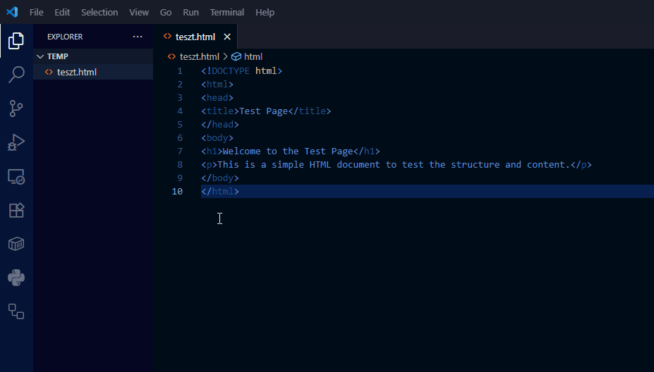

# Verziókezelés alapok és Git bevezető (GUI fókusszal)

Ez az útmutató segít megérteni a verziókezelés fontosságát és elsajátítani a Git alapjait a Visual Studio Code (VS Code) grafikus felületének és a GitHub segítségével.

## A verziókezelés alapjai

### Mi az a verziókezelés és miért hasznos?

Képzeld el, hogy egy fontos egyetemi beadandón dolgozol. Elmented a fájlt `beadando_v1.docx` néven. Később módosítasz rajta, és elmented `beadando_v2.docx` néven, majd jön a `beadando_vegleges.docx`, és végül a `beadando_TENYLEG_vegleges_javitott.docx`. Ismerős, ugye?

Ez a módszer kaotikus, nehezen követhető, és ha többen dolgoztok egy projekten, kész rémálommá válhat.

A **verziókezelő rendszer (Version Control System - VCS)** egy szoftver, ami pontosan ezt a problémát oldja meg. Lehetővé teszi, hogy:

* **Mentsd a projekt állapotait:** Ahelyett, hogy fájlokat másolgatnál, a rendszer "pillanatképeket" (**commitokat**) készít a projektedről minden egyes mentésnél.

* **Visszatérj egy korábbi állapothoz:** Ha elrontottál valamit, egyetlen kattintással visszaállhatsz egy korábbi, működő verzióra.

* **Párhuzamosan dolgozz:** Különböző funkciókon vagy részeken dolgozhatsz anélkül, hogy zavarnátok egymás munkáját (ezt nevezik "**branching**"-nek, azaz elágaztatásnak).

* **Nyomon kövesd a változásokat:** Pontosan láthatod, hogy ki, mikor és mit módosított a kódban. Ez rendkívül hasznos a hibakeresésnél és a közös munkánál.

### Milyen megközelítések vannak?

1. **Központosított (Centralized VCS):** Itt egy központi szerver tárolja a projekt teljes történetét. A fejlesztők erről a szerverről töltik le a legfrissebb verziót, majd a módosításaikat ide töltik vissza. Hátránya, hogy ha a központi szerver elérhetetlen, a munka leáll. (Példa: Subversion - SVN).

2. **Elosztott (Distributed VCS - DVCS):** Itt minden fejlesztő számítógépén a projekt teljes másolata (repository) megtalálható, a teljes előtörténettel együtt. Ez sokkal rugalmasabb, mert a mentéseket (commitokat) lokálisan is elvégezheted, és csak akkor kell a központi tárolóval (pl. GitHub) szinkronizálnod, amikor internetközelben vagy. **A Git a legnépszerűbb elosztott verziókezelő rendszer.**

A félév során a Git verziókezelővel fogunk dolgozni.

## Git és Visual Studio Code

### Hogyan kezdjünk neki?

A Git és a VS Code párosa rendkívül hatékony. A VS Code beépített Git-támogatással rendelkezik, ami vizuálisan is megkönnyíti a verziókezelést.

**1. lépés: Telepítés**

* **Git:** Töltsd le és telepítsd a [hivatalos oldalról](https://git-scm.com/downloads). A telepítés során a legtöbb alapbeállítás megfelelő lesz.

**2. lépés: Konfiguráció (Ez az egyetlen terminálos lépés)**
Mielőtt teljesen a grafikus felületre váltanánk, egyetlen alkalommal be kell mutatkoznunk a Gitnek. Ezt a legegyszerűbben a VS Code beépített termináljában tehetjük meg (`Terminal > New Terminal`). Add meg a neved és az e--mail címed. Ezek az adatok fognak megjelenni a mentéseid (commitjaid) mellett.

```
git config --global user.name "A Te Neved"
git config --global user.email "a-te-email@címed.com"
```

Erre a lépésre a jövőben nem lesz szükség, innentől minden kattintásokkal működik.

**3. lépés: Az első lokális repository (projektmappa) létrehozása**

1. Hozz létre egy új mappát a projektednek (pl. `elso-git-projekt`).

2. Nyisd meg ezt a mappát a VS Code-ban (`File > Open Folder...`).

3. Kattints a bal oldali sávon a **Source Control** (Forráskezelés) ikonra (úgy néz ki, mint egy elágazás).

4. Mivel a mappa még nem verziókezelt, a VS Code felajánl egy nagy kék gombot: **Initialize Repository**. Kattints rá!

   Ezzel a kattintással a VS Code a háttérben futtatta a `git init` parancsot, és létrehozta a rejtett `.git` mappát, ami a verziókezeléshez szükséges összes információt tárolja.

**4. lépés: Az első fájl verziókezelése**

1. Hozz létre egy új fájlt a VS Code-ban, pl. `teszt.html`.

2. Írj bele valamilyen tartalmat, például egy egyszerű HTML vázat.

3. Mentsd el a fájlt.

A **Source Control** panelen látni fogod, hogy az `teszt.html` a "Changes" (Változások) listában van. A Git észlelte, hogy van egy új, még nem követett fájlod.

**A Git alapvető munkafolyamata (Staging és Commit):**

A Gitben két lépésben mentjük el a változásokat:

1. **Staging (előkészítés):** Kiválasztod azokat a módosított fájlokat, amiket egy "csomagban" szeretnél elmenteni.

2. **Commit (véglegesítés):** Az előkészített fájlokat egy üzenettel ellátva véglegesen elmented a projekt történetébe.

**Hogyan csináld ezt VS Code-ban?**

1. A **Source Control** panelen, a `Changes` lista mellett vidd az egeret az `teszt.html` fájl fölé, és kattints a `+` **(Stage Changes)** ikonra. Ezzel a fájl átkerül a "Staged Changes" (Előkészített változások) szakaszba.

2. Az ablak tetején, a "Message" (Üzenet) mezőbe írj egy rövid, de informatív üzenetet, ami leírja a változtatást. Pl.: `Projekt inicializálása, teszt.html létrehozása`.

3. Kattints a `Commit` gombra (vagy a pipa ikonra).

Gratulálok, elkészítetted az első commitodat! A projekt jelenlegi állapota biztonságban el van mentve.

A folyamat főbb lépéseit a lenti animáción követheted.



### GitHub

A **GitHub** egy webalapú szolgáltatás, ami Git repository-k tárolására szolgál. Olyan, mint egy "felhő" a Git projektjeidnek. Lehetővé teszi, hogy:

* **Biztonsági másolatot** készíts a kódodról.

* **Bárhonnan elérd** a projektjeidet.

* **Másokkal is megoszd** a kódodat és **együtt dolgozzatok** rajta.

#### Kód feltöltése GitHubra VS Code segítségével

**1. Lépés: GitHub fiók létrehozása**

* Ha még nincs, regisztrálj egy fiókot a [github.com](https://github.com) oldalon.

**2. Lépés: A projekt publikálása GitHubra**
A VS Code ezt a folyamatot hihetetlenül leegyszerűsíti. Nem kell a GitHub weboldalán létrehoznod a tárolót, a VS Code mindent elintéz helyetted.

1. A **Source Control** panelen látni fogsz egy **Publish to GitHub** gombot. Kattints rá!

2. A VS Code fel fogja ajánlani, hogy jelentkezz be a GitHub fiókodba. Engedélyezd a hozzáférést a böngészőben.

3. A bejelentkezés után a VS Code megkérdezi, hogy milyen néven szeretnéd létrehozni a tárolót a GitHubon (alapértelmezetten a mappa nevét ajánlja fel), és hogy az **privát** vagy **nyilvános** legyen.

   * **Private:** Csak te és az általad meghívott személyek láthatják.

   * **Public:** Bárki láthatja az interneten.

4. Válaszd ki a neked megfelelőt, és hagyd, hogy a VS Code feltöltse a fájlokat.

Ha minden sikeres, a VS Code a háttérben létrehozta a repository-t a GitHubon, összekapcsolta a lokális projekteddel, és fel is töltötte az első commitodat. Ha most megnyitod a GitHub profilodat a böngészőben, látni fogod az új repository-t a feltöltött `index.html` fájllal!

**A jövőbeli munkafolyamat:**

Innentől kezdve a munkafolyamat a következő:

1. Dolgozol a fájlokon lokálisan, majd elmented őket.

2. A **Source Control** panelen a `+` ikonnal `Stage`-eled a változtatásokat.

3. Írsz egy commit üzenetet, és a `Commit` gombbal elmented a változást a lokális történetbe.

4. Amikor a változtatásokat a GitHubra is fel szeretnéd tölteni, kattints a bal alsó sarokban található **Sync Changes** gombra. Ez letölti a távoli változásokat (ha vannak) és feltölti a tieidet.

Ezzel a tudással már képes vagy önállóan vagy csapatban is hatékonyan kezelni a projektjeidet, szinte teljes egészében a VS Code kényelmes, grafikus felületén. Sok sikert!
