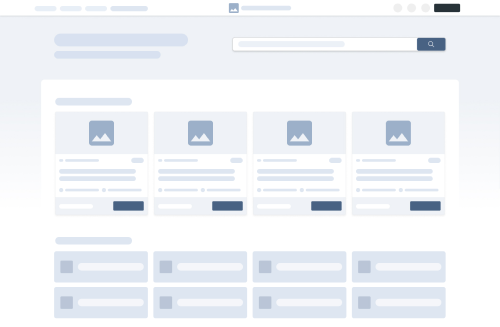

# Felhasználói felület tervezése a webfejlesztés folyamatában

Egy nagy látogatottságú weboldal jelentős értékkel bír. Miután növeli a cég imidzsét, láthatóvá teszi a céget akár távoli régiókban is, növeli a piacot, gyors és megbízható kommunikációt tesz lehetővé. Nem mellesleg 24 órás reklámhordozó.

A hatékony digitális design messze túlmutat az esztétikán: tudatos problémamegoldás, amelynek célja a felhasználói viselkedés pozitív befolyásolása. A **jó design** nem szubjektív ízlés kérdése, hanem jól definiált elveken alapul.

## A webfejlesztés folyamata dióhéjban

Bár a kurzus a HTML, CSS és JavaScript technikai részleteire koncentrál, a kódolás egy nagyobb, több lépésből álló folyamat része. A sikeres weboldal titka a gondos előkészítésben rejlik. Az alábbi vázlat egy általánosan elfogadott, **felhasználóközpontú folyamatot** mutat be, amely segít elhelyezni a programozói munkát a teljes projekt térképén.

### 1. Kutatás és Stratégia (A „Miért?”)

Mielőtt egyetlen vonalat is rajzolnánk vagy kódot írnánk, tisztázni kell a weboldal alapjait. Ebben a fázisban határozzuk meg a projekt **célját** (pl. eladás, informálás, regisztráció) és a **célközönségét** (kiknek készül az oldal?). Itt történik a piackutatás, a versenytársak elemzése és a legfontosabb funkciók meghatározása. Az eredmény egy letisztázott koncepció, ami a további munka alapját képezi.

### 2. Tervezés: UX és UI (A „Hogyan?”)

Ez a fázis alakítja a stratégiát kézzelfogható tervekké. A folyamat a durva vázlatoktól halad a részletesen kidolgozott, interaktív tervek felé. A két fő területe a felhasználói élmény (UX) és a felhasználói felület (UI) tervezése.

* **UX (User Experience) Design**: A felhasználói élmény stratégiai tervezése. A cél, hogy a weboldal használata logikus, intuitív és hatékony legyen. A UX-tervező felel a tartalom struktúrájáért, a felhasználói útvonalakért és azért, hogy a felhasználó könnyen elérje a célját.
* **UI (User Interface) Design**: A felhasználói felület vizuális megtervezése. Ide tartozik a gombok, menük, űrlapok és egyéb elemek kinézete, a színek, a tipográfia és a grafikai elemek egységes, esztétikus rendszere.

A tervezési folyamat kézzelfogható lépései és eredményei:

1.  **Drótváz (Wireframe):** Az első konkrét lépés. A drótváz egy **alacsony részletességű, fekete-fehér vázlat**, amely a weboldal „csontváza”. Csak az elemek elhelyezkedésére, a funkciókra és az információs architektúrára fókuszál, a vizuális megjelenésre nem. Célja a szerkezet gyors és olcsó tesztelése.

2.  **Látványterv (Mockup):** A drótvázra épülő **statikus, de vizuálisan kidolgozott terv**. A mockup már a végleges kinézetet mutatja be: tartalmazza a színeket, betűtípusokat, ikonokat és képeket. Lényegében egy nagy felbontású kép arról, hogyan fog kinézni a kész weboldal, de még nem interaktív.
3.  **Prototípus (Prototype):** A látványtervekből készített **interaktív, kattintható verzió**. A prototípus már szimulálja a weboldal működését: a gombokra kattintva lehet navigálni az oldalak között, meg lehet nézni az animációkat. Lehetővé teszi a felhasználói élmény alapos tesztelését és a visszajelzések begyűjtését még a fejlesztés megkezdése előtt.

> [!NOTE]
> Több elmélet is létezik, amely leírja, hogy „mitől jó egy design”. Érdemes megemlíteni a [Gestalt-alapelveket](https://uxdesignblog.hu/articles/gestalt), valamint [Jakob Nielsen 10 használhatósági heurisztikáját](https://innovationdesign.hu/ux/10-usability-heurisztika-nielsen/), amelyek a jó felhasználói felület alapkövei.

### 3. Fejlesztés (A megvalósítás)

Itt kel életre a terv. A fejlesztők a jóváhagyott prototípus és a vizuális tervek alapján leprogramozzák a weboldal működő, interaktív felületét. A két fő területéről (Frontend, Backend) már korábban olvashattunk az [Egy modern webalkalmazás anatómiája](../week01/01-fullstack.md) fejezetben.

### 4. Tesztelés, Indítás és Optimalizálás (A finomhangolás)

Az elkészült oldalt alaposan tesztelni kell különböző eszközökön és böngészőkben, hogy minden hibátlanul működjön. Az indítás (élesítés) után a munka nem áll meg: **analitikai adatok** (pl. Google Analytics) alapján a szakemberek folyamatosan figyelik a felhasználói viselkedést, és fejlesztik a weboldalt a még jobb eredményekért.

A webfejlesztés és a webdesign nem választható el élesen; a sikeres végtermék e szakterületek szoros együttműködésének eredménye.

> [!NOTE]
> Fenti felosztás egy lineáris ([vízesésszerű](https://www.geeksforgeeks.org/software-engineering/waterfall-model/)) megközelítést vázol fel az érthetőség kedvéért. A modern gyakorlatban gyakran használnak iteratív, rugalmasabb módszereket, mint az [Agilis módszertan](https://www.geeksforgeeks.org/software-testing/what-is-agile-methodology/) vagy a [DevOps](https://www.geeksforgeeks.org/devops/introduction-to-devops/).