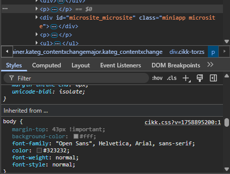

# Gyakorló feladat

A feladat két részből áll. Az első részben a Moodle-be feltöltött értékelő adatlap segítségével kell dolgoznotok, majd a gyűjtött tapasztalatok alapján igényesen megformázni egy szöveget.

## 1. rész: Weboldalak kiértékelése

A Moodle gyakorlati színterébe feltöltött adatlap segítségével értékelj ki három weboldalt. A feladat célja, hogy jó gyakorlatokat gyűjtsetek lehetséges hiányosságok, fejlesztendő területek azonosítása mellett. Használjátok bátran az `F12` billentyű lenyomásával megjelenő *DevTools* eszközt, amivel megvizsgálhatjátok, hogy adott HTML tag-re milyen stílusbeállítások vonatkoznak.



## 2. rész: Szöveg formázása CSS segítségével

Az 1. részben gyűjtött tapasztalatok alapján a következő HTML dokumentumot igényesen formázd meg. Ha valamilyen CSS-t még nem ismersz, nyugodtan keress rá a neten és/vagy kérj segítséget a gyakorlatvezetőtől.

```html
<!DOCTYPE html>
<html lang="hu">
<head>
    <meta charset="UTF-8">
    <meta name="viewport" content="width=device-width, initial-scale=1.0">
    <title>A Római Birodalom Felemelkedése</title>
    <link rel="stylesheet" href="style.css">
</head>
<body>

    <header id="main-header">
        <h1>Antik Történelem Magazin</h1>
    </header>

    <nav>
        <ul>
            <li><a href="#">Kezdőlap</a></li>
            <li><a href="#">Görögország</a></li>
            <li><a href="#">Róma</a></li>
            <li><a href="#">Egyiptom</a></li>
        </ul>
    </nav>

    <main>
        <article>
            <h2 class="article-title">A Római Birodalom Felemelkedése: A Városállamtól a Világhatalomig</h2>
            
            <section>
                <h3>A kezdetek: Mítosz és valóság</h3>
                <p>Róma alapítását a hagyomány szerint Kr. e. 753-ra datálják, Romulus és Remus legendás történetével, akiket egy anyafarkas nevelt fel. Bár ez a történet a mitológia ködébe vész, a régészeti leletek valóban egy korai település nyomait tárták fel a Palatinus-dombon. A városállam kezdetben etruszk királyok uralma alatt állt, majd Kr. e. 509-ben a királyságot elűzve kikiáltották a köztársaságot. Ez a politikai fordulat alapozta meg Róma jövőbeli hatalmát. A köztársaság korai időszakát a patríciusok (arisztokrácia) és a plebejusok (köznép) közötti társadalmi küzdelmek jellemezték, amelyek végül a plebejusok jogainak kiterjesztéséhez és egy stabilabb politikai rendszer kialakulásához vezettek, amely a Szenátuson és a népgyűléseken alapult.</p>
                <p>A korai köztársaság folyamatos harcokat vívott a környező latin, etruszk és szabin törzsekkel az Itáliai-félsziget feletti hegemóniáért. Ezek a háborúk nemcsak Róma területét növelték, hanem formálták katonai szervezetét és stratégiáját is. A légiók fegyelmezettsége és a római hadmérnöki tudás páratlan volt a korban, ami lehetővé tette számukra, hogy sorozatos győzelmeket arassanak. A meghódított területekkel szemben Róma egyedülálló politikát folytatott: ahelyett, hogy teljesen leigázta volna őket, szövetségesi rendszert épített ki, amelyben a különböző városok jogokat és autonómiát kaptak, cserébe katonai szolgálatért és hűségért. Ez a "divide et impera" (oszd meg és uralkodj) elv biztosította a félsziget stabilitását és Róma tartós befolyását.</p>
            </section>

            <section>
                <h3>A pun háborúk és a Mediterráneum meghódítása</h3>
                <p class="kiemelt-gondolat">A Római Köztársaság igazi erőpróbája a Karthágó elleni három pun háború volt (Kr. e. 264–146). Karthágó, a föníciai alapítású észak-afrikai tengeri hatalom, Róma legfőbb riválisa volt a Földközi-tenger nyugati medencéjének irányításáért. Az első háború Szicília birtoklásáért folyt, és Róma tengeri flottájának felépítésével, valamint a karthágóiak legyőzésével ért véget. A második pun háború Hannibal legendás hadjáratáról híres, aki az Alpokon átkelve elefántjaival fenyegette Rómát, de végül vereséget szenvedett. A harmadik háború Karthágó teljes elpusztításával zárult, amivel Róma vitathatatlanul a Mediterráneum urává vált.</p>
                <p>A pun háborúk megnyerése után Róma terjeszkedése felgyorsult. Kelet felé fordulva meghódították a hellenisztikus királyságokat, köztük Makedóniát és Görögországot, amelynek gazdag kultúrája mély hatást gyakorolt a római társadalomra. A hódítások hatalmas gazdagságot és rabszolgatömegeket áramoltattak Rómába, ami alapjaiban változtatta meg a gazdasági és társadalmi viszonyokat. A kisbirtokos parasztság tönkrement, helyüket a rabszolgamunkán alapuló nagybirtokok (latifundiumok) vették át, ami súlyos társadalmi feszültségekhez és politikai instabilitáshoz vezetett.</p>
            </section>

            <section>
                <h3>A köztársaság válságától a császárságig</h3>
                <p>A Kr. e. 1. század a köztársaság válságának és a polgárháborúk korának időszaka volt. A hatalmasra nőtt birodalmat a régi köztársasági intézmények már nem tudták hatékonyan kormányozni. A hadsereg átalakult: a polgárkatonák helyét zsoldos seregek vették át, amelyek hűsége már nem a köztársasághoz, hanem közvetlenül a hadvezérükhöz kötődött. Olyan karizmatikus és ambiciózus hadvezérek emelkedtek fel, mint Marius, Sulla, Pompeius és a leghíresebb, Julius Caesar. Caesar galliai hódításaival óriási hírnévre és vagyonra tett szert, ami lehetővé tette számára, hogy szembeszálljon a Szenátussal és Pompeiusszal. A polgárháborúból győztesen került ki, és örökös diktátorrá neveztette ki magát, de reformjait már nem tudta befejezni, mert Kr. e. 44-ben a köztársaságpárti szenátorok egy csoportja meggyilkolta.</p>
                <p>Caesar halála újabb polgárháborúk sorozatát indította el, amelyből unokaöccse és fogadott fia, Octavianus került ki győztesen. Miután legyőzte riválisait, Marcus Antoniust és Kleopátrát az actiumi csatában (Kr. e. 31), Octavianus egyeduralkodóvá vált. Bölcsen elkerülte a királyi címet, és a köztársaság megmentőjeként tüntette fel magát. Létrehozta a principátus rendszerét, amelyben a köztársasági intézmények látszólag megmaradtak, de a tényleges hatalom az ő kezében összpontosult. A Szenátustól megkapta az "Augustus" (Fenséges) címet, és ezzel ő lett Róma első császára. Uralma egy hosszú, békés és virágzó időszakot hozott el, a <a href="https://hu.wikipedia.org/wiki/Pax_Romana" target="_blank">Pax Romanát</a>, amely a Római Birodalom aranykorát jelentette.</p>
            </section>

        </article>
    </main>

    <footer>
        <p>&copy; 2025 Antik Történelem Magazin. Minden jog fenntartva.</p>
    </footer>

</body>
</html>
```

### Kiinduló CSS

```css
/* FELADAT: A SZÖVEG FORMÁZÁSA
  Ebben a fájlban NINCSENEK szövegformázási szabályok (pl. font-family, color, font-size).
  A te feladatod, hogy a tanult szelektorokkal és tulajdonságokkal
  kialakítsd a cikk olvasható és esztétikus tipográfiáját.
*/

/* Az oldal alapvető beállításai */
body {
    background-color: #f4f4f4;
    margin: 0;
    padding: 0;
}

/* Fejléc stílusai */
header#main-header {
    background-color: #333;
    padding: 1rem;
}

/* Navigációs sáv */
nav {
    background-color: #444;
    padding: 0.5rem 0;
    text-align: center; /* A menüpontok középre igazítása */
}

nav ul {
    margin: 0;
    padding: 0;
    list-style-type: none; /* A lista pontjainak eltávolítása */
}

nav ul li {
    display: inline-block; /* A menüpontok egymás mellé kerülnek */
    margin: 0 1rem;
}

/* A fő tartalmi rész konténere */
main {
    max-width: 900px; /* Olvasható sorszélesség beállítása */
    margin: 2rem auto; /* Felül-alul térköz, oldalt automatikus középre igazítás */
    padding: 2rem;
    background-color: #ffffff;
    border: 1px solid #ddd;
}

/* Lábléc stílusai */
footer {
    background-color: #333;
    color: #ccc;
    text-align: center;
    padding: 1rem;
    margin-top: 2rem;
}

/* ----- A TE MUNKÁD ITT KEZDŐDIK ----- */

/* Példa feladatok, amiket meg kell oldanod:
  1. Importálj egy betűtípust a Google Fonts-ból és állítsd be a body-ra!
  2. Válassz szelektorokat (pl. h1, h2, .article-title, p) és adj nekik méretet, színt, sorközt!
  3. Formázd a .kiemelt-gondolat osztályú bekezdést, hogy kitűnjön!
  4. Formázd a linkeket (<a>), és adj nekik :hover állapotot!
  5. Használj szelektor-készletet a h2 és h3 közös formázásához!
*/
```