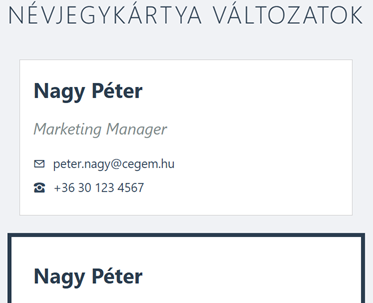

# Névjegykártya készítése - Dobozmodell gyakorlat

## Célkitűzés
Digitális névjegykártyák létrehozása (`nevjegykartya.html`), amelyek bemutatják a CSS dobozmodell működését különböző padding, margin és border beállításokkal.

## CSS fájl beillesztése
Töltsd le a `doboz_alap.css` fájlt a Moodle-ről ugyanabba a mappába, ahol a HTML fájlod lesz! Ez tartalmazza az oldal alapformázását. Kapcsold be a HTML fájlodba a megfelelő módon a `<head>` részben.

## 1. HTML alapstruktúra

Készítsd el a `nevjegykartya.html` fájlt a szokásos HTML5 struktúrával. Az oldalnak legyen egy főcíme, valamint három div elem, amelyek a névjegykártya változatokat fogják tartalmazni. Mindegyik div kapjon egy egyedi osztályt: `kartya-1`, `kartya-2`, és `kartya-3`.

## 2. Kártyák tartalma

Mindhárom kártyába helyezz el:
- Egy második szintű címsort a névvel (pl. "Nagy Péter")
- Egy bekezdést a beosztással, amely kapjon egy "beosztas" osztályt
- Egy bekezdést az email címmel, "email" osztállyal
- Egy bekezdést a telefonszámmal, "telefon" osztállyal

Használj saját adatokat vagy kitalált információkat.

## 3. CSS stílusok hozzáadása

A HTML fájlban hozz létre egy `<style>` elemet a `<head>` részben, a külső CSS link után. Itt fogod megírni a dobozmodell gyakorló stílusokat.

### Alapbeállítások

Először állítsd be, hogy mindhárom kártya 350 pixel széles legyen, fehér háttérszínű, és vízszintesen középre igazított az oldalon.

**Tipp:** 
- Több osztályt vesszővel elválasztva lehet egyszerre kiválasztani
- A `margin: 20px auto;` középre igazít egy fix szélességű elemet

## 4. Egyedi kártya stílusok

### Első kártya - Egyszerű változat
Adj hozzá egy vékony, világosszürke keretet és kisebb belső térközt (padding). Használj 1 pixel vastag, `#cccccc` színű szegélyt.

### Második kártya - Vastag keret
Készíts egy feltűnőbb változatot vastagabb, sötétebb kerettel (5 pixel, `#2c3e50` szín) és nagyobb belső térközzel (25 pixel minden oldalon).

### Harmadik kártya - Modern változat
Alkalmazz:
- 2 pixel vastag kék keretet (`#3498db`)
- Aszimmetrikus paddinget (függőlegesen 30px, vízszintesen 20px)
- Kerekített sarkokat 10 pixel sugarú ívvel
- Enyhe árnyékot a doboz alatt

**Tipp:** Az árnyékhoz használd: `box-shadow: 0 2px 5px rgba(0,0,0,0.1);`

## 5. Szövegelemek formázása

Formázd meg a kártyákon belüli szövegeket:
- A nevek legyenek sötét színűek, és ne legyen felső margójuk
- A beosztás legyen szürkés és dőlt betűs
- Az email és telefon elemek kapjanak kis függőleges margót (5px)

## 6. Kísérletezz és figyeld meg!

### Teljes szélesség számítása
Számold ki mindhárom kártya valódi szélességét! Ne felejtsd el hozzáadni:
- Az alapszélességet (width)
- A bal és jobb paddinget
- A bal és jobb border vastagságát

Írd le HTML kommentben a számításaidat!

### Margó összeomlás tesztelése
Adj alsó margót a kártyáknak és figyeld meg, hogyan viselkednek egymás alatt! Miért nem adódnak össze a margók?

### Extra kihívás: Border-box kísérlet
Készíts egy negyedik kártyát, amelynél alkalmazod a `box-sizing: border-box` tulajdonságot. Használd ugyanazokat a méreteket, mint a második kártyánál. Mi a különbség?

## Ellenőrzési lista

- [ ] Van DOCTYPE és megfelelő HTML struktúra?
- [ ] A külső CSS fájl be van linkelve?
- [ ] Mindhárom kártya elkészült a saját osztályával?
- [ ] A kártyák tartalma teljes (név, beosztás, email, telefon)?
- [ ] A kártyák középre vannak igazítva?
- [ ] Különböző padding és border beállítások alkalmazva?
- [ ] A harmadik kártya kerekített és árnyékolt?
- [ ] A teljes szélesség számítások dokumentálva vannak?

## Megoldás feltöltése
Töltsd fel a kész `nevjegykartya.html` fájlt a Moodle-re.

**Hasznos eszköz:** A böngésző Fejlesztői eszközeiben (F12) a "Computed" fülön vizuálisan láthatod a dobozmodell minden értékét!