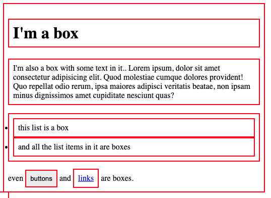

# Dobozmodell és szegélyek

## Bevezetés a Dobozmodellbe

A weboldalon lévő minden elem körül egy doboz helyezkedik el. E dobozok megértése kulcsfontosságú a komplex elrendezések (layoutok) létrehozásához és az elemek egymáshoz való igazításához.



### A dobozok alaptípusai: Block és Inline

A CSS dobozok viselkedését alapvetően a **külső megjelenítési típus** (outer display type) határozza meg, amely megmondja, hogyan helyezkedik el a doboz a többi dobozhoz képest.

1.  **Block Dobozok (Blokkszintű elemek):**
    *   A doboz mindig **új sorban kezdődik**.
    *   A `width` (szélesség) és `height` (magasság) tulajdonságok érvényesülnek.
    *   A beállított margók (*margin*), kitöltések (*padding*) és szegélyek (*border*) eltolják a többi elemet a doboztól.
    *   Ha nincs szélesség megadva, a doboz kitölti a rendelkezésre álló helyet a konténerében (általában 100% szélesség).
    *   *Példa*: `<h1>`, `<p>`, `<ul>` elemek alapértelmezetten blokk típusúak.

2.  **Inline Dobozok (Sorszintű elemek):**
    *   A doboz **nem kezdődik új sorban**.
    *   A `width` és `height` tulajdonságokat **figyelmen kívül hagyja**.
    *   A felső és alsó margók, kitöltések és szegélyek érvényesülnek, de **nem tolják el** a körülötte lévő tartalom sorait (átfedést okozhatnak).
    *   A bal és jobb oldali margók, kitöltések és szegélyek érvényesülnek, és eltolják a többi sorszintű dobozt.
    *   *Példa*: `<a>`, `<span>`, `<em>` elemek alapértelmezetten sorszintűek.

### Alaptípusok átmenete: inline-block

Ez egy speciális `display` érték, amely átmenetet képez a sorszintű és a blokkszintű viselkedés között.

*   **Nem kezd új sorban** (inline tulajdonság).
*   **Figyelembe veszi** a `width` és `height` tulajdonságokat (block tulajdonság).
*   A margók, kitöltések és szegélyek minden oldalon **eltolják a többi elemet** (elkerülve az átfedést, ami az alapértelmezett inline elemeknél történik).
*   Gyakran használják navigációs sávok linkjeinél, ahol szeretnénk kitöltést alkalmazni az elemekre anélkül, hogy új sorba törnénk őket.

>[!NOTE]
>A tananyag alján lehet látni egy összetett példát, amiben említett beállítások kipróbálhatók.

## A CSS Dobozmodell Részei

A blokkszintű doboz négy koncentrikus rétegből áll:

1.  **Tartalom Doboz (Content box):** A terület, ahol a tartalom (szöveg, képek) megjelenik. Ezt méretezzük a `width` és `height` tulajdonságokkal.
2.  **Kitöltés Doboz (Padding box):** A tartalom körül lévő fehér tér. Ezt a `padding` tulajdonsággal méretezzük.
3.  **Szegély Doboz (Border box):** A szegély/keret, amely a tartalmat és a kitöltést veszi körül. Ezt a `border` tulajdonsággal méretezzük.
4.  **Margó Doboz (Margin box):** A legkülső réteg, amely láthatatlan teret hoz létre a doboz és más elemek között (whitespace). Ezt a `margin` tulajdonsággal méretezzük.


>[!NOTE]
>A margó nem számít bele magának a doboznak a tényleges méretébe — csak az általa elfoglalt teljes területbe a lapon. A doboz területe a szegélynél áll meg, nem terjed ki a margóra.

## Standard vs. Alternatív Dobozmodell

Kétféle dobozmodell létezik; alapértelmezetten a böngészők a standard dobozmodellt használják.

### 1. Standard Dobozmodell (Content-Box)

Ebben a modellben a `width` és `height` értékek a **tartalom doboz** szélességét és magasságát határozzák meg.

*   **Teljes szélesség** = *tartalom szélessége* (`width`) + *kitöltés* (bal és jobb) + *szegély* (bal és jobb).
*   *Példa:* Ha egy doboz `width`-e 350px, a `padding` 25px mindkét oldalon, és a `border` 5px mindkét oldalon, akkor a teljes helyigénye: $350 + 25 + 25 + 5 + 5 = **410px**$.

### 2. Alternatív Dobozmodell (Border-Box)

Ebben a modellben a beállított `width` és `height` értékek magát a **látható doboz** méretét (tartalom + kitöltés + szegély) határozzák meg.

*   A tartalom területének szélessége a beállított szélesség mínusz a kitöltés és a szegély szélessége.
*   Ez kényelmes, mivel nem kell külön összeadnunk a szegélyt és a kitöltést, hogy megkapjuk a doboz valós méretét.
*   A modell aktiválása: a `box-sizing` tulajdonság beállításával.

```css
.box {
    box-sizing: border-box; /* Alternatív dobozmodell bekapcsolása */
}
```

>[!NOTE]
>Gyakori választás a fejlesztők körében, hogy az alternatív dobozmodellt használják minden elemen. Ezt egy univerzális resettel lehet beállítani, az `<html>` elemen beállítva a `box-sizing`-ot, majd a többi elemen örököltetve azt.

```css
html { box-sizing: border-box; }
* { box-sizing: inherit; }
```

## Szegélyek, Kitöltés és Margók Részletesen

### A Szegély (Border)

A szegély a margó és a kitöltés között helyezkedik el.

#### Szegély Tulajdonságok

A szegélyek stílusához, szélességéhez és színéhez számos tulajdonság áll rendelkezésre, amelyekkel mind a négy oldalt egyszerre lehet beállítani (shorthand), vagy oldalanként/tulajdonságonként külön-külön (longhand).

| Tulajdonság típusa | Leírás | Példa (shorthand) |
| :--- | :--- | :--- |
| **Összes szegély (Shorthand)** | Beállítja mind a négy oldal szélességét, stílusát és színét. | `border: 5px solid black;` |
| **Oldalankénti beállítás** | A négy oldal egyedi beállítása. | `border-top`, `border-right`, `border-bottom`, `border-left` |
| **Egyedi tulajdonságok** | A stílus, a szélesség vagy a szín beállítása az összes oldalra. | `border-width`, `border-style: dotted;`, `border-color` |
| **Granuláris beállítás** | Egy adott oldal adott tulajdonságának beállítása (pl. stílus). | `border-bottom-color: hotpink;` |

### Kitöltés (Padding)

A kitöltés (belső térköz) a szegély és a tartalom területe között helyezkedik el, és a tartalom eltolására szolgál a szegélytől.

*   A kitöltés értéke **nem lehet negatív**.
*   Az elem háttere a kitöltés mögött is megjelenik.
*   Sorszintű elemeknél (pl. `<span>`) a felső/alsó kitöltés nem tolja el a sorokat, átfedést okozhat.

#### Kitöltés Tulajdonságok

A `padding` tulajdonság beállítja az összes oldalt egyszerre.

*   **Összefoglaló (Shorthand):** `padding: 1em;` (mind a négy oldalra 1em).
*   **Oldalankénti (Longhand):** `padding-top`, `padding-right`, `padding-bottom`, `padding-left`.

### Margó (Margin)

A margó (külső térköz) egy láthatatlan tér a doboz körül, amely **eltolja a többi elemet**. A margó a látható doboz méretének kiszámítása után adódik hozzá.

*   A margók értéke lehet **pozitív vagy negatív**; a negatív margók elemek átfedését okozhatják.
*   Sorszintű elemeknél (inline) a felső és alsó margó érvényesül, de nem tolja el a környező sorokat; csak a bal és jobb margó okoz eltolást.

#### Margó Tulajdonságok

A `margin` tulajdonság beállítja mind a négy oldalt egyszerre.

*   **Összefoglaló (Shorthand):** A margók beállíthatók egy rövidített formában, az óramutató járásával megegyező sorrendben (felül, jobb, alul, bal).

```css
.box {
    margin: 20px 1em 40px 2em;
}
/* Felül 20px, Jobbra 1em, Alul 40px, Balra 2em */
```

*   **Oldalankénti (Longhand):** `margin-top`, `margin-right`, `margin-bottom`, `margin-left`.

### Margó Összeomlás (Margin Collapsing)

Ez a jelenség akkor fordul elő, amikor két blokkszintű elem **függőleges margói** (pl. az első elem `margin-bottom`-je és a második elem `margin-top`-ja) összeérnek.

*   **Két pozitív margó esetén:** A két margó egy margóvá egyesül, melynek mérete a **két margó közül a legnagyobbik** értékkel lesz egyenlő.
*   **Két negatív margó esetén:** Az omlás után a kisebb (nullától távolabbi) negatív érték lesz a mérvadó.
*   Ha az egyik margó negatív, az érték **kivonódik** az összegből.

>[!NOTE]
>A margó összeomlás (collapsing) csak a **függőleges margókra** vonatkozik; a vízszintes margók nem omlanak össze.

A böngésző Fejlesztői Eszközei (DevTools) segítségével mindig ellenőrizheti az elemek valós méretét, margóját, kitöltését és szegélyét, ami megkönnyíti a dobozmodell megértését.

```html
<!DOCTYPE html>
<html lang="hu">
<head>
    <meta charset="UTF-8">
    <title>CSS Dobozmodell bemutató</title>
    <style>
        /* Alapértelmezett beállítások és közös stílusok */
        body { 
            font-family: sans-serif; 
            margin: 20px;
            background-color: #f4f4f9; 
        }

        /* Minden dobozra beállítjuk a méretet és a térközt */
        .box {
            width: 300px;
            height: 70px;
            padding: 20px;
            margin: 30px;
            border: 5px solid darkblue;
            box-sizing: content-box; /* Standard dobozmodell (alapértelmezett) */
            text-align: center;
            line-height: 70px; /* Magasság közepére igazítás a tartalom dobozon belül */
        }

        h3 {
            margin-top: 40px; 
            color: #333;
        }
        
        /* ------------------------------------------- */
        /* 1. BLOKKSZINTŰ DOBOZ (Alapértelmezett viselkedés) */
        /* ------------------------------------------- */
        .block-example {
            background-color: lightcoral;
            /* width és height érvényesül. A teljes méret (40px padding + 10px border) hozzáadódik a 300px width-hez. */
        }

        /* ------------------------------------------- */
        /* 2. SORSZINTŰ DOBOZ (display: inline) */
        /* ------------------------------------------- */
        .inline-container {
            border: 2px dashed #607d8b;
            padding: 10px;
            line-height: 1.8; /* Hogy jobban látszódjon az átfedés */
        }

        .inline-example {
            background-color: yellow;
            color: black;
            border-color: red;
            /* A width és height (300px / 70px) figyelmen kívül hagyódik.
               A függőleges padding és border ÉRVÉNYESÜL, de átfedést okoz a környező szöveggel. 
               A bal/jobb padding és margin ELTOLJA a tartalmat. */
        }

        /* ------------------------------------------- */
        /* 3. INLINE-BLOCK DOBOZ (display: inline-block) */
        /* ------------------------------------------- */
        .inline-block-example {
            background-color: lightgreen;
            color: darkgreen;
            border-color: darkgreen;
            display: inline-block; /* A kulcs: sorszintű, de blokk viselkedéssel */
            /* A width és height ÉRVÉNYESÜL.
               A padding, border és margin eltávolítja a többi elemet. */
        }

    </style>
</head>
<body>

    <h1>A Dobozmodell: Display típusok összehasonlítása</h1>

    <h3>1. Blokkszintű doboz (Block Box)</h3>
    <div class="box block-example">
        Ez egy div (blokk). Új sort kezd és a width/height érvényes.
    </div>
    <div class="box block-example" style="width: 150px; height: 30px;">
        Ez egy másik blokk. Láthatóan alá került.
    </div>

    <h3>2. Sorszintű doboz (Inline Box)</h3>
    <p class="inline-container">
        Ez egy bekezdés, amelyen belül van egy <span class="box inline-example">Inline SPAN</span> elem, ami nem kezd új sort.
        Figyeljük meg, hogy a beállított 300px szélességet és 70px magasságot a böngésző **figyelmen kívül hagyja**, és a doboz csak akkora, amekkora a tartalom. A függőleges margók és kitöltések **átfedést** okoznak a szöveg soraival.
    </p>

    <h3>3. Inline-Block doboz</h3>
    <p class="inline-container">
        Ez egy bekezdés, amelyen belül van egy <span class="box inline-block-example">Inline-Block SPAN</span> elem.
        Ez az elem már **figyelembe veszi** a 300px szélességet és a 70px magasságot, és a padding/border/margin vertikálisan is **eltolja** a környező elemeket, de **nem kezd** új sort, ellentétben a blokk elemekkel.
    </p>

</body>
</html>
```

A szöveg AI felhasználásával készült.

Források:
* [The Odin Project: The Box Model](https://www.theodinproject.com/lessons/foundations-the-box-model)
* [CSS Solid: CSS Box Model](https://www.csssolid.com/css-box-model.html)
* [MDN: The Box Model](https://developer.mozilla.org/en-US/docs/Learn_web_development/Core/Styling_basics/Box_model)