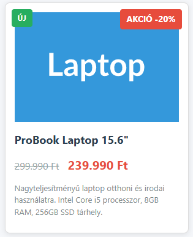

# Akciós termék doboz - Pozícionálás gyakorlat

## Célkitűzés
Egy termékkártya létrehozása (`termek_akcio.html`), amely bemutatja a relatív és abszolút pozícionálás működését. A termék képére egy "AKCIÓ" címkét helyezünk el CSS pozícionálással.

## CSS fájl beillesztése
Töltsd le a `termek_alap.css` fájlt a Moodle-ből ugyanabba a mappába, ahol a HTML fájlod lesz! Ez tartalmazza az oldal és a termékdoboz alapformázását. Kapcsold be a HTML fájlodba a megfelelő módon.

## 1. HTML alapstruktúra

Készítsd el a `termek_akcio.html` fájlt a szokásos HTML5 struktúrával. Az oldalnak legyen:
- Egy főcíme ("Akciós termékek")
- Egy konténer div `termek-kontener` osztállyal
- A konténeren belül egy kép és egy akciós címke

## 2. Termék konténer felépítése

A `termek-kontener` div-be helyezz el:
- Egy termékkép (`` elem), amely lehet bármilyen termék fotója (pl. laptop.jpg)
  - **Tipp:** Használhatsz placeholder képet: `https://placehold.co/300x200/3498db/ffffff?text=Laptop	`
  - Adj alt szöveget a képhez!
- Egy span vagy div elemet `akcio-cimke` osztállyal, amelybe az "AKCIÓ -20%" szöveg kerül
- A kép után adj hozzá egy címsort a termék nevével
- Egy div-et, amiben két span található `eredeti-ar` és `akcio-ar` osztályokkal. Eredeti ár áthúzva és új ár kiemelve.
- Egy rövid termékleírást bekezdésbe.

## 3. CSS pozícionálás beállítása

A HTML fájlban hozz létre egy `<style>` elemet a `<head>` részben. Itt fogod beállítani a pozícionálást.

### Konténer beállítása

A `termek-kontener` osztály kapjon:
- 300 pixel szélességet
- Fehér háttérszínt
- Vékony szürke keretet
- Belső térközt (padding) 15 pixel
- És ami a legfontosabb: relatív pozícionálást!

**Miért kell a relative?** Ez hozza létre azt a "koordináta-rendszert", amihez képest az absolute elemeket pozícionálhatjuk.

### Akciós címke pozícionálása

Az `akcio-cimke` osztály beállításai:
- Abszolút pozícionálás (így kivesszük a normál dokumentumfolyamból)
- Helyezd a konténer jobb felső sarkába
  - **Tipp:** Használd a `top` és `right` tulajdonságokat, 10-10 pixel távolsággal
- Piros háttérszín (`#e74c3c`)
- Fehér szövegszín
- Padding a szöveg körül (5px vízszintesen, 10px függőlegesen)
- Félkövér betűtípus

## 4. Kép formázása

Állítsd be, hogy a termék képe:
- Teljes szélességben kitöltse a konténert
- Megtartsa az arányait (`height: auto`)
- Blokkszintű elem legyen (hogy ne legyen alatta üres hely)

## 5. Kísérletezz a pozícionálással!

### Különböző pozíciók kipróbálása
Próbáld ki az akciós címkét más pozíciókban is:
- Bal felső sarok: `top: 10px; left: 10px;`
- Jobb alsó sarok: mit kell használni?
- Pontosan középen: `top: 50%; left: 50%; transform: translate(-50%, -50%);`

### Mi történik relative nélkül?
Kommenteld ki ideiglenesen a `position: relative` sort a konténerből! Hova kerül a címke? Miért?

### Extra címkék hozzáadása
Adj hozzá egy második címkét "ÚJ" felirattal a bal felső sarokba! Használj zöld hátteret.

## 6. Ár és leírás formázása

Formázd meg a termék információit:
- A termék neve legyen nagyobb méretű és félkövér
- Az eredeti ár legyen áthúzott (`text-decoration: line-through`) és szürke
- Az akciós ár legyen nagyobb és piros színű
- A leírás legyen kisebb betűméretű és szürke

## Ellenőrzési lista

- [ ] Van DOCTYPE és megfelelő HTML struktúra?
- [ ] A külső CSS fájl be van linkelve?
- [ ] A termék konténer relative pozícionálású?
- [ ] Az akciós címke absolute pozícionálású?
- [ ] A címke a megfelelő sarokban van (top/right értékekkel)?
- [ ] A kép responsive (width: 100%)?
- [ ] Van termék név, ár és leírás?
- [ ] A címke a kép fölött jelenik meg?
- [ ] Kipróbáltad más pozíciókban is a címkét?

## Megoldás feltöltése
Töltsd fel a kész `termek_akcio.html` fájlt a Moodle-re.

**Hasznos tipp:** A böngésző Fejlesztői eszközeiben kapcsold ki/be a `position` tulajdonságokat, hogy lásd, hogyan változik az elrendezés!