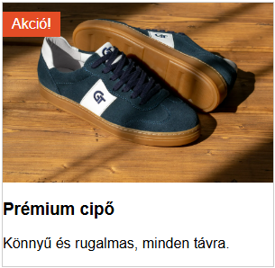

# Abszolút és Relatív Pozícionálás

A CSS-ben az elemek elrendezése (Layout) alapvető fontosságú. A pozícionálás a CSS elrendezési módszerek közé tartozik. A pozícionálás megértése kulcsfontosságú az elemek oldalra való elhelyezéséhez vagy egymáshoz viszonyított igazításához.

## A Pozícionálás Módjai

A CSS elrendezésben a `position` tulajdonság segítségével térhetünk el az elemek normál dokumentumfolyamban történő elhelyezkedésétől.

### Relatív Pozícionálás

A **relatív pozícionálás** (`position: relative;`) egy elem eredeti, a normál dokumentumfolyamatban elfoglalt helyéhez képest történő elmozdítását teszi lehetővé. Fontos megjegyezni, hogy bár az elem vizuálisan elmozdul, az eredeti helye üresen marad, és a többi elem továbbra is úgy viselkedik, mintha az elem az eredeti pozíciójában lenne. Az elmozdítást a `top`, `right`, `bottom`, és `left` tulajdonságokkal adhatjuk meg.

Például, ha egy elemet `10px`-lel lejjebb és `20px`-lel jobbra szeretnénk tolni az eredeti helyéről:

```css
.relativ-elem {
  position: relative;
  top: 10px;
  left: 20px;
}
```

Ez a beállítás azt eredményezi, hogy az `.relativ-elem` osztályú elem a normál pozíciójától 10 pixellel lefelé és 20 pixellel jobbra fog megjelenni, de az őt körülvevő elemek elrendezése nem változik.

### Abszolút Pozícionálás

Az **abszolút pozícionálás** (`position: absolute;`) teljesen kiveszi az elemet a dokumentum normál folyamatából. Ez azt jelenti, hogy a többi elem úgy fog viselkedni, mintha az abszolút pozicionált elem ott sem lenne, és az általa korábban elfoglalt helyet is elfoglalhatják.

Az abszolút pozicionált elem a legközelebbi, nem `static` (azaz `relative`, `absolute`, `fixed`, vagy `sticky`) pozíciójú szülőeleméhez képest pozícionálódik a `top`, `right`, `bottom`, és `left` tulajdonságok segítségével. Ha nincs ilyen szülőelem, akkor a `<body>` elemhez, azaz a dokumentum széléhez igazodik.

Például, ha van egy szülő- és egy gyerek-elemünk:

```html
<div class="szulo">
  <div class="gyerek"></div>
</div>
```

És a következő CSS-t alkalmazzuk:

```css
.szulo {
  position: relative; /* Pozícionálási kontextust ad a gyereknek */
  width: 200px;
  height: 200px;
  border: 1px solid black;
}

.gyerek {
  position: absolute;
  top: 20px;
  right: 20px;
  width: 50px;
  height: 50px;
  background-color: red;
}
```

A `.gyerek` elem a `.szulo` elem jobb felső sarkától `20px`-re fog elhelyezkedni, mivel a szülő `position: relative;` tulajdonsága pozícionálási kontextust teremt számára. Ha a szülőnek nem adnánk meg a `position: relative;`-et, a piros négyzet a `<body>` elem jobb felső sarkához igazodna.

### Gyakorlati alkalmazás és reszponzivitás

A modern webfejlesztésben a `position: relative` és `position: absolute` párosítása az egyik leggyakrabban használt technika, különösen reszponzív környezetben. Bár az oldalak fő szerkezetét ma már leginkább a **Flexbox** és a **Grid** határozza meg, a pozícionálás továbbra is nélkülözhetetlen az elemek egymáson való rétegzéséhez és a komponenseken belüli finomhangoláshoz.

#### A relatív szülő mint "ketrec"

Fontos megérteni, hogy amint egy szülőelemre (`<div>`) rákerül a `position: relative;`, az egyfajta **koordináta-rendszert vagy "ketrecet" hoz létre** a benne lévő, `position: absolute;`-tal ellátott gyerek-elemek számára. A `top: 0; left: 0;` egy abszolút pozicionált elemen belül azt jelenti, hogy a relatív szülő bal felső sarkához igazodik (pontosabban a `padding`-on belüli területhez), nem pedig a böngészőablak széléhez.

Ez a "ketrec" modell teszi lehetővé, hogy összetett, mégis jól kontrollálható és reszponzív komponenseket hozzunk létre. Mivel a gyerek-elem a szülőhöz igazodik, a szülő mozgatásával vagy átméretezésével a gyerek is arányosan vele mozog, megőrizve a belső elrendezést.

#### Hol használjuk a reszponzív designban?

1.  **Feliratok és ikonok elhelyezése képeken:** Ez a leggyakoribb felhasználási mód. Egy képkonténer kap egy `position: relative`-et, a képre helyezett szöveg, "Új" címke, vagy egy lejátszás ikon pedig `position: absolute`-ot kap. Így a felirat mindig a kép sarkában vagy közepén marad, függetlenül attól, hogy a kép hogyan méreteződik át a különböző képernyőkön.

2.  **Lenyíló menük és tooltip-ek (buborékok):** Amikor egy menüpont vagy egy ikon fölé visszük az egeret, a megjelenő almenü vagy információs buborék (`tooltip`) `position: absolute`-ot használ, hogy a megfelelő helyen jelenjen meg anélkül, hogy szétlökne más elemeket az oldalon. A szülő menüpont `position: relative`-et kap.

3.  **Ikonok beviteli mezőkben:** Egy keresőmezőben elhelyezett nagyító ikon tipikusan egy `position: relative` tárolóban lévő `<input>` mező mellett `position: absolute`-tal van beigazítva a mező szélére.

Az alábbi példa egy reszponzív termékkártyát mutat, ahol egy "Akció!" címke van a kép sarkára helyezve. A kártya mérete változhat, de a címke a helyén marad.



```html
<div class="termek-kartya">
  
  <span class="akcio-cimke">Akció!</span>
  <h3>Prémium cipő</h3>
  <p>Könnyű és rugalmas, minden távra.</p>
</div>
```

```css
.termek-kartya {
  position: relative; /* Létrehozza a "ketrecet" a címke számára */
  width: 80%; /* Reszponzív szélesség */
  max-width: 300px;
  border: 1px solid #ccc;
  font-family: Arial, sans-serif;
}

.termek-kartya img {
  width: 100%;
  height: auto;
  display: block;
}

.akcio-cimke {
  position: absolute; /* Kiemeljük a normál dokumentumfolyamból */
  top: 10px;          /* A szülő tetejétől 10px-re */
  left: 0;            /* A szülő bal oldalához igazítva */
  background-color: #e44d26;
  color: white;
  padding: 5px 10px;
}
```
Ez a módszer biztosítja, hogy a vizuális elemek szorosan összetartozzanak és együtt mozogjanak, ami a reszponzív design alapkövetelménye.