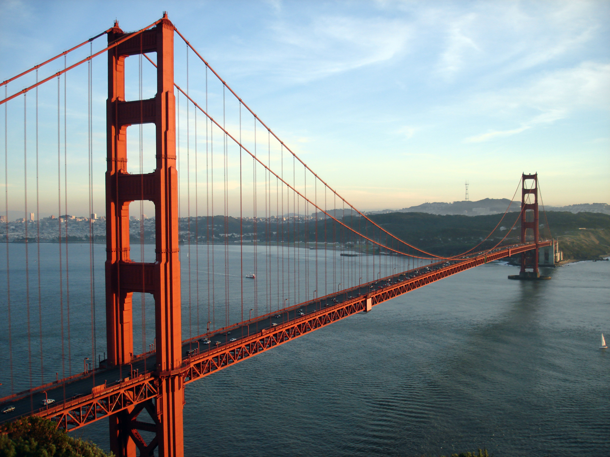

# Képek stílusbeállításai

A kép elhelyezése és vizuális stílusa (színvilág, kontraszt) tudatos tervezési döntés, amely a tartalom elrendezésének szerves része. A modern CSS eszközökkel a kép és a szöveg viszonya precízen szabályozható: a képet elhelyezhetjük a szövegblokkok között, mellettük, vagy akár szöveggel körbe is futtathatjuk a dinamikus és olvasóbarát elrendezés érdekében. A cél, hogy a vizuális elemek támogassák és tagolják a tartalmat, ne pedig elszigetelten álljanak mellette.

## Képek és szövegek egymás mellett

* **Ha a kép a fókuszpont, ami bemutatja a témát,** akkor érdemes a bal oldalra helyezni, mert az olvasó tekintete itt kezdi a pásztázást. A kép felkelti az érdeklődést, a mellette lévő szöveg pedig kifejti a részleteket. Ideális például egy cikk bevezetőjéhez vagy egy portfólió elem bemutatásához.

* **Ha a kép kiegészítő információt hordoz, illusztrál vagy lezár egy gondolatot,** akkor hatékony lehet a jobb oldalon elhelyezni. Miután a felhasználó már elkezdte olvasni a szöveget, a kép vizuális megerősítést, példát vagy egy kapcsolódó mellékinformációt nyújt anélkül, hogy megszakítaná az olvasás kezdeti lendületét.

A kép a honlapon leginkább a törzsben használatos. Ez az `` tag segítségével lehetséges, ahol a kép forrását az `src` attribútummal kell megadni.
* `src="kep.gif"`: ugyanazon könyvtárban van
* `src="images/kep.gif"`: "eggyel lejjebb" van, az images könyvtárban
* `src="../../images/kep.gif"`: A kép és a html lap párhuzamos ágakon van, a kép 1, míg a html lap 2 szinttel lejjebb

>[!NOTE]
>Korábban említettük az `alt` attribútumot, amelynek az akadálymentesítésben van nagy szerepe. Pl. képernyőfelolvasó szoftver az `alt` értékét olvassa fel, de ez a szöveg jelenik meg, ha valamilyen okból kifolyólag nem sikerül a böngészőnek a képet betöltenie. Ha a kép csak díszítőelem, akkor üres érték adandó meg.

```html
<!DOCTYPE html>
<html lang="hu">
<head>
    <meta charset="UTF-8">
    <meta name="viewport" content="width=device-width, initial-scale=1.0">
    <title>Kép igazítása</title>
    <link rel="stylesheet" href="style.css">
</head>
<body>

    <h1>Kép balra és jobbra igazítása</h1>

    <p class="szovegblokk">
        
        Ez a szöveg egy **balra igazított kép** mellett jelenik meg. A CSS `float: left;` tulajdonsága a képet a szülőelem bal szélére helyezi, a szöveg pedig körülötte folytatódik a jobb oldalon. A `margin` tulajdonsággal biztosítunk elegendő térközt a kép és a szöveg között, hogy az elrendezés szellős és olvasható legyen. Ez a leggyakoribb megoldás, ha a kép egy bekezdés elején, fókuszpontként szerepel.
    </p>

    <p class="szovegblokk">
        
        Ez a szöveg egy **jobbra igazított kép** mellett látható. A `float: right;` utasítás a képet a tároló jobb szélére tolja, a szöveg pedig a bal oldalán folyik körbe. Ez a technika akkor hasznos, ha a kép egy gondolatot illusztrál vagy zár le anélkül, hogy megtörné az olvasás folyamatát. A kép és a szöveg közötti távolságot itt is a `margin` segítségével állítjuk be.
    </p>

</body>
</html>
```

```css
/* Általános beállítások a jobb olvashatóságért */
body {
    font-family: Arial, sans-serif;
    line-height: 1.6;
    max-width: 750px;
    margin: 20px auto;
    padding: 0 15px;
}

/*
.szovegblokk {
    overflow: auto;
    margin-bottom: 25px;
}
*/

/* Kép balra igazítása */
.kep-bal {
    float: left;
    margin-right: 15px; /* Térköz a kép jobb oldalán */
    margin-bottom: 5px;  /* Térköz a kép alatt */
}

/* Kép jobbra igazítása */
.kep-jobb {
    float: right;
    margin-left: 15px;  /* Térköz a kép bal oldalán */
    margin-bottom: 5px;   /* Térköz a kép alatt */
}
```

## Képek méretezése

Figyelnünk kell azonban arra is, hogy a képek ne legyenek nagy méretűek. Előfordulhat, ha a kép sokáig tölt be, akkor a látogató  elhagyja az oldalt (különösen gyenge térerő mellett mobilon). A CSS átméretező tulajdonságai (pl. `width: 100px; height: 100px`) nem az eredeti kép méretét változtatja meg, hanem a megjelenítés módját. Ha a képeket más méretben szeretnénk használni, mint az eredeti mérete, akkor érdemes azt előtte egy képszerkesztő programmal átméretezni (akár *MS Paint*). A weben leginkább használható képfájl típusok: **gif, jpg, png, webp**.

Átmérezetést követően, ha szeretnénk, hogy **reszponzív módon** jelenjenek meg a képek, az alábbi CSS beállításokat szükséges használni.

```css
img {
  max-width: 100%;
  height: auto;
}
```

## Képkeretek

A `border-radius` segítségével kerekített szegélyeket is használhatunk.

```css
img {
  border-radius: 8px;
  /*border-radius: 50%;*/
}
```

Miniatűr bélyegképek készítéséhez a CSS `border` tulajdonságát hívhatjuk segítségül.

```css
img {
  border: 1px solid #ddd;
  border-radius: 4px;
  padding: 5px;
  width: 150px;
}

img:hover {
  box-shadow: 0 0 2px 1px rgba(0, 140, 186, 0.5);
}
```

## Szöveg pozícionálása képen

A szöveg elhelyezése egy képen hatékony vizuális technika, amely kiemelheti az üzenetet. Ehhez általában egy tárolóelemre (`<div>`) van szükség, amely magában foglalja a képet és a rá helyezendő szöveget is. A tárolóelem `position` tulajdonságát `relative`-re, a szövegét pedig `absolute`-ra állítjuk. Így a szöveg pozícióját a tárolóelemhez (és ezáltal a képhez) képest tudjuk megadni.

Az alábbi példákhoz tartozó közös HTML struktúra:

```html
<!DOCTYPE html>
<html lang="hu">
<head>
    <meta charset="UTF-8">
    <meta name="viewport" content="width=device-width, initial-scale=1.0">
    <title>Szöveg pozícionálása képen</title>
    <link rel="stylesheet" href="style.css">
</head>
<body>

    <h1>Szöveg pozícionálása</h1>

    <div class="container">
        
        <div class="szoveg-bal-felso">Bal felső</div>
        <div class="szoveg-jobb-also">Jobb alsó</div>
        <div class="szoveg-kozep">Középen</div>
    </div>

</body>
</html>
```

A közös CSS alapbeállítás a tárolóelemre:

```css
.container {
  position: relative; /* A belső elemek ehhez képest pozícionálódnak */
  text-align: center; /* A szövegek alapértelmezett igazítása */
  color: white; /* A szövegek színe */
  font-family: Arial, sans-serif;
  max-width: 600px; /* Példa méret */
  margin: auto;
}
```

### Bal felső sarki szöveg

A szöveget a tároló bal felső sarkához igazítjuk a `top` és `left` tulajdonságokkal. Egy kis `padding` (belső margó) hozzáadásával elkerülhetjük, hogy a szöveg teljesen a kép szélére tapadjon.

```css
.container {
  position: relative; /* A belső elemek ehhez képest pozícionálódnak */
  color: white;
  font-family: Arial, sans-serif;
}

.szoveg-bal-felso {
  position: absolute;
  top: 8px;
  left: 16px;
}

img {
    width: 100%;
}
```

### Jobb alsó sarki szöveg

Hasonlóan az előzőhöz, itt a `bottom` és `right` tulajdonságokat használjuk a szöveg pozicionálására a tároló jobb alsó sarkába.

```css
.container {
  position: relative; /* A belső elemek ehhez képest pozícionálódnak */
  color: white;
  font-family: Arial, sans-serif;
}

.szoveg-jobb-also {
  position: absolute;
  bottom: 8px;
  right: 16px;
}
```

### Középre igazított szöveg

A tökéletes középre igazításhoz a `top: 50%` és `left: 50%` értékekkel a szöveg bal felső sarkát a kép közepére helyezzük. Ezt követően a `transform: translate(-50%, -50%)` szabállyal a szöveget a saját magasságának és szélességének felével toljuk el visszafelé, így a szöveg tényleges közepe kerül a kép közepére.

```css
.container {
  position: relative; /* A belső elemek ehhez képest pozícionálódnak */
  text-align: center;
  color: white;
  font-family: Arial, sans-serif;
}

.szoveg-kozep {
  position: absolute;
  top: 50%;
  left: 50%;
  transform: translate(-50%, -50%);
  background-color: rgba(0, 0, 0, 0.5); /* Opcionális háttér a jobb olvashatóságért */
  padding: 10px 20px;
  border-radius: 5px;
}
```

## Háttérkép beállítása

| Tulajdonság | Szerepe | Leggyakoribb értékek |
| :--- | :--- | :--- |
| **`background-color`** | Háttérszín beállítása (pl. ha a kép nem tölt be). | `#333`, `rgba(0,0,0,0.5)` |
| **`background-image`** | Háttérkép megadása az `url()` függvénnyel. | `url("hero.jpg")` |
| **`background-repeat`** | A kép ismétlődésének szabályozása. | `no-repeat`, `repeat` |
| **`background-position`** | A kép igazítása az elemen belül. | `center`, `top right` |
| **`background-size`** | A kép méretezése (pl. a terület kitöltésére). | `cover`, `contain` |
| **`background-attachment`**| A kép görgetésének viselkedése. | `fixed`, `scroll` |

Ezeket az egyedi tulajdonságokat kombinálja a sokkal gyakrabban használt, összefoglaló `background` parancs. (Lásd lentebb.)

Tegyük fel, hogy egy weboldal fejlécének szeretnénk egy háttérképet beállítani, ami nem ismétlődik, középre van igazítva, teljesen kitölti a rendelkezésre álló helyet, és görgetéskor a helyén marad.

```css
.hero-header {
  /* Hosszú, részletes módszer */
  background-color: #333; /* Sötét háttér, ha a kép nem tölt be */
  background-image: url("GoldenGateBridge-001.jpg");
  background-repeat: no-repeat;
  background-position: center center;
  background-size: cover;
  background-attachment: fixed;

  /* Ugyanaz a hatás az összefoglaló, profi módszerrel */
  background: #333 url("GoldenGateBridge-001.jpg") no-repeat fixed center/cover;
}
```