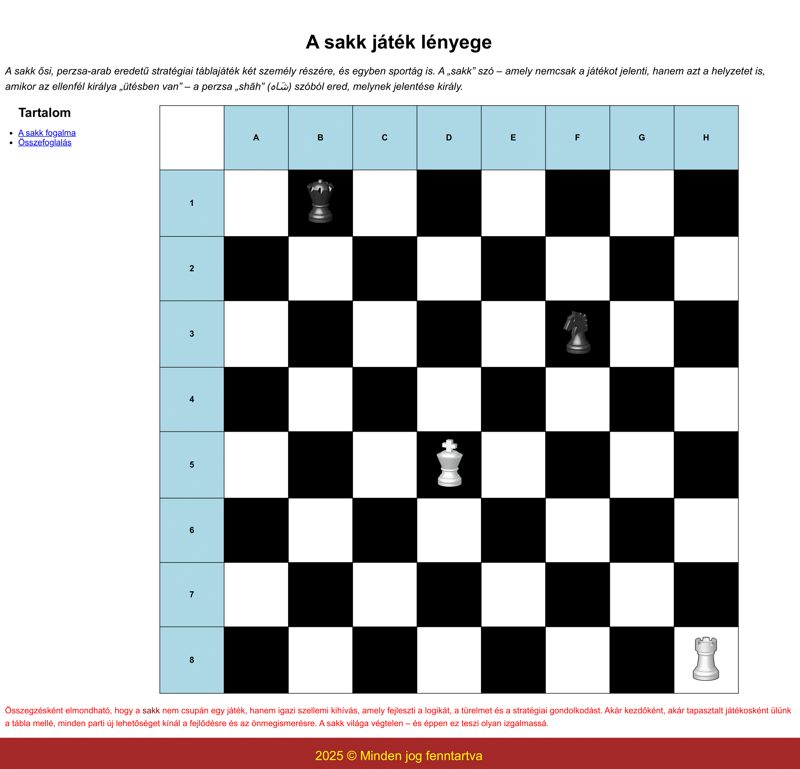

# Sakk weboldal készítése - Lépésről lépésre útmutató

**Szerző:** Békefi Ottó
**Közreműködött:** Biró András

Az elkészítendő weboldal célja a sakkjáték bemutatása egy egyszerű, letisztult felületen. A központi elem egy sakktábla, amelyen néhány sakk figurát helyezünk el. Az oldal tartalmaz rövid ismertetőt a játékról, és egy összegző gondolatot a sakk szellemi értékeiről. Az oldalon való navigálását menü segíti.

Készítsd el a weboldalt az alábbi kép mintájára!

## 1. lépés: Projekt előkészítése

Alakíts ki egy modern weboldalnak megfelelő mappastruktúrát!
- Pl.: képek külön mappában, egyértelmű, egyszerű fájlnevekkel

## 2. lépés: HTML alap létrehozása

Nyisd meg az `index.html` fájlt és állítsd be az alapvető HTML struktúrát, megfelelő paraméterekkel (nyelv, stíluslap, stb.)

> [!TIP]
> VS Code-ban gépeld be a "!" karaktert és nyomj Enter-t a HTML váz automatikus létrehozásához.

## 3. lépés: HTML struktúra létrehozása

Az oldal három fő részből álljon:
1. Fejléc: Főcím és bevezető bekezdés
2. Tartalom: Navigációs menü, a sakktábla és egy záró bekezdés
3. Lábléc: Lábjegyzet szerzői jogi információval

### Fejléc létrehozása

A fejléc részbe helyezz el:
- Egy 1. szintű címsort "A sakk játék lényege" szöveggel
- Egy bekezdést a sakkról szóló ismertetővel, amely `bekezdes` azonosítóval rendelkezik

### Tartalom létrehozása

A tartalom részbe kerüljön:

1. Egy navigációs menü a következő tartalommal:
   - Egy 2. szintű címsor "Tartalom" szöveggel
   - Egy rendezetlen lista, amely az oldal fő részeire (2 bekezdés: az oldal elején, és végén) mutató linkeket tartalmaz

2. Egy 9×9-es táblázat, amely a sakktáblát reprezentálja:
   - Az első sor megfelelő celláiba írd az A-H betűket
   - A többi sor első cellájába írd az 1-8 számokat
   - A megfelelő cellákba helyezd el a sakk bábuk képeit:
     * fekete királynő
     * fehér király
     * fekete huszár
     * fehér bástya

> [!TIP]
> VS Code-ban használhatod az Emmet rövidítést a táblázat vázának gyors létrehozásához: `table>tbody>tr*9>td*9`

2. Egy záró bekezdés, amelynek azonosítója `befejezes`, és tartalmaz egy összefoglalást és egy speciálisan formázott linket a sakk Wikipédia oldalára (Például: `Összegzésként elmondható, hogy a sakk nem csupán egy játék, hanem igazi szellemi kihívás, amely fejleszti a logikát, a türelmet és a stratégiai gondolkodást. Akár kezdőként, akár tapasztalt játékosként ülünk a tábla mellé, minden parti új lehetőséget kínál a fejlődésre és az önmegismerésre. A sakk világa végtelen – és éppen ez teszi olyan izgalmassá.`)

### Lábléc létrehozása

A láblécbe helyezz egy bekezdést, amely tartalmazza a "2025 (copyright jel) Minden jog fenntartva" szöveget.

> [!TIP]
> A copyright jelet a speciális karakterként adhatod hozzá (& jellel kezdődnek, pontosvesszővel végződnek)!

## 4. lépés: CSS stílusok létrehozása

Hozz létre egy `style.css` fájlt és haladj végig az alábbi lépéseken:

### 4.1 Alapbeállítások

Nullázd le a margót, és a padding-et minden elemre, illetve állíts be egyéni betűtípust a teljes oldalra.

Állítsd be a navigációs menü megfelelő elhelyezését is:
- A menü balra igazítása
- A menü a tartalom méretét vegye fel
- Padding hozzáadása jobb- és baloldalra

### 4.2 Táblázat formázása

- Tüntesd el a felesleges dupla szegélyeket
- Igazítsd középre a táblázatot
- A cellákra állíts be fekete szegélyt, minden cella négyzet alakú legyen
- Gondoskodj a cellák tartalmának középre igazításáról

### 4.3 Sakktábla mintázat kialakítása

A sakktábla fekete-fehér mintázatának kialakításához használhatsz CSS **pszeudo-osztályokat** vagy **általános osztályokat** is.

> [!NOTE]
> **CSS pszeudo-osztályok magyarázata:**
> 
> A pszeudo-osztályok speciális szelektorok, amelyek lehetővé teszik elemek kiválasztását a dokumentum-struktúrában elfoglalt helyük vagy állapotuk alapján:
> 
> - `:first-child` - Kiválasztja az elemet, ha az a szülőjének első gyermeke
> - `:nth-child(n)` - Kiválasztja az elemet, ha az a szülőjének n-edik gyermeke
> - `:nth-child(even)` - Kiválasztja a páros sorszámú gyermekelemeket
> - `:nth-child(odd)` - Kiválasztja a páratlan sorszámú gyermekelemeket
> - `:nth-child(n+m)` - Kiválasztja az elemeket az m-ediktől kezdve
>
> Az `n` helyére képletet is írhatunk, például:
> - `2n` vagy `even`: minden páros elem (2., 4., 6. stb.)
> - `2n+1` vagy `odd`: minden páratlan elem (1., 3., 5. stb.)
> - `n+4`: a 4. elemtől kezdve minden elem
> - `3n+1`: minden 3. elem, kezdve az 1. elemmel (1., 4., 7. stb.)

Állítsd be a következő stílusokat:
- Az első sor összes cellája és minden sor első cellája legyen világoskék hátterű és a szöveg félkövér
- Az első sor első cellája (a bal felső sarok) legyen fehér hátterű

### 4.4 Képek formázása

1. Állíts be megfelelő stílusokat a sakk bábuk képeire:
   - A képek mérete a cella magasságához igazodjon
   - A képek a cella közepén helyezkedjenek el

### 4.5 Szöveges elemek formázása

Formázd a következő szöveges elemeket:
- h1 címsor: középre igazított, 36px méret, 20px margó
- h2 címsor: 24px méret, 15px alsó margó
- Bevezető bekezdés (`bekezdes` azonosító): 15px margó, dőlt betűs, 1.2em betűméret
- Záró bekezdés (`befejezes` azonosító): 15px margó, piros betűszín
- Mind a bevezető, mind a záró bekezdés: 1.5-ös sormagasság
- Lábléc bekezdés: sárga betűszín, barna háttérszín, 1.5em betűméret, középre igazított, 20px padding

### 4.6 Link formázása a láblécben

Állítsd be a link különböző állapotainak stílusait:
- Alapértelmezett állapot: sötétvörös szín, nincs aláhúzás
- Ha felévisszük a kurzort: aláhúzott
- Meglátogatott állapot: fekete szín

> [!IMPORTANT]
>Ügyelj arra, hogy csak a láblécben található linket formázd, a navigációs menüben találhatóakat ne!

Jó munkát!

[Megoldás](./megoldas.md)