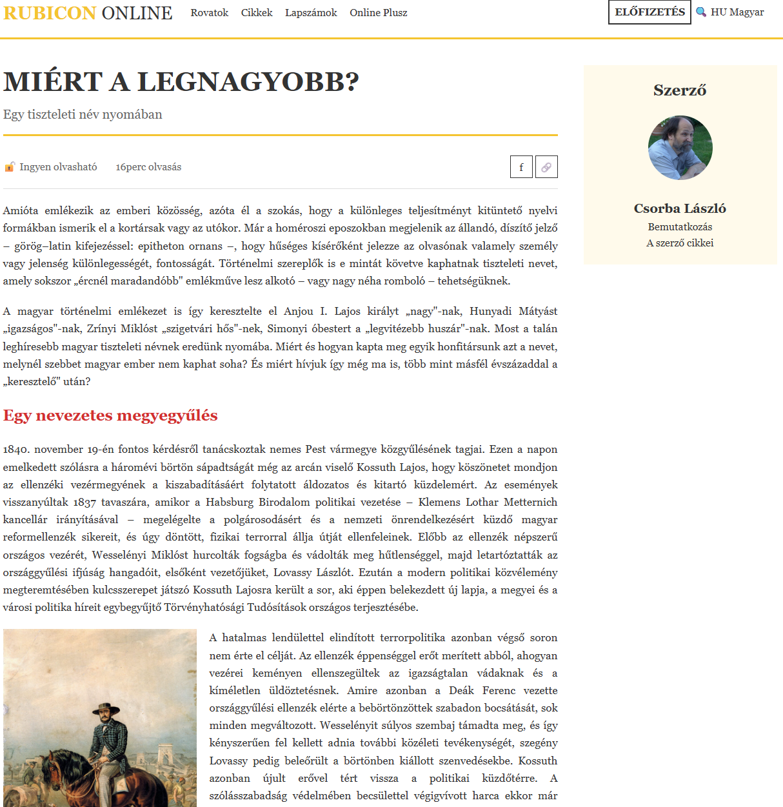
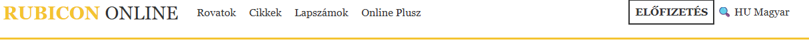
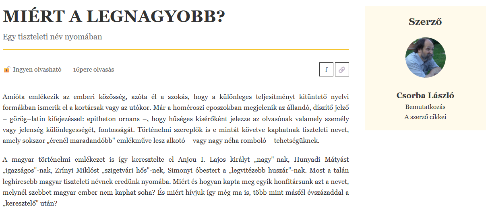
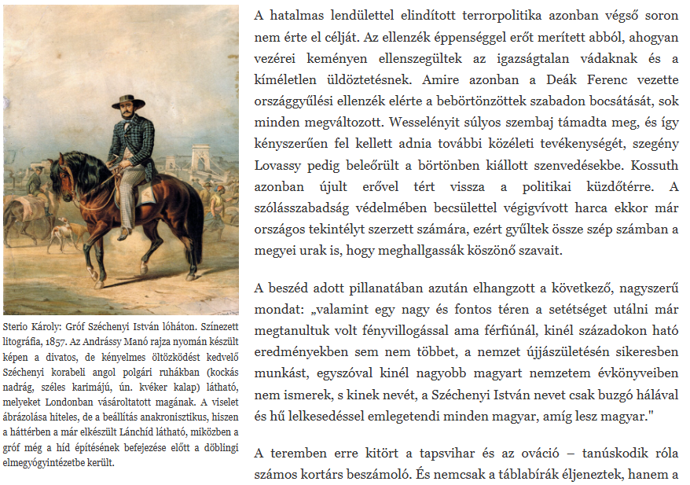

# Rubicon cikk oldal

## Célkitűzés
Egy híroldalhoz hasonló cikk oldal létrehozása, amely lehetőséget ad az eddigiek gyakorlására. Az oldalon egy header menüt, kétoszlopos tartalmat és lebegő képet fogunk formázni.

>[!NOTE]
>**Ne feledd:** A cél nem a pixel-pontos másolás, hanem a gyakorlás. Ha valami kicsit másképp néz ki, mint a referencia, az rendben van, amíg az alapelvek helyesek.

## Kiindulási fájlok
Töltsd le a `rubicon_article_alap.html` fájlt a Moodle-ről! Ez tartalmazza az oldal HTML vázát, de még nincsenek rajta osztálynevek és formázások. 

## 1. Előkészületek és alapbeállítások

### 1.1 Univerzális reset és body beállítások
Kezdd a CSS-t úgy, hogy minden elemet nullázol (margin, padding), és beállítod a `box-sizing: border-box` tulajdonságot.

Ezután a body elemre állítsd be:
- A betűtípust (Georgia vagy más serif)
- A sortávolságot (legyen kényelmesen olvasható, 1.5-1.8 körüli érték)
- A szöveg színét (sötétszürke)
- A háttérszínt (fehér)

## 2. Header elkészítése float elrendezéssel

### 2.1 Header alap formázása
A header elem számára:
- Adj alsó szegélyt, ami 3 pixel vastag és arany színű (a sárga árnyalata: `#f4c430`)
- Adj belső térközt felül-alul (15 pixel körül)
- **Kritikus:** Állítsd be a `display` tulajdonságát `flow-root` értékre, hogy a benne lebegő elemek ne "lógjanak ki" belőle

>[!NOTE]
>**Miért kell a flow-root?** Amikor float-okat használsz, azok "kikerülnek" a normál dokumentumfolyamból. A flow-root biztosítja, hogy a konténer magassága igazodjon a float elemekhez.

### 2.2 Header konténer (szélesség korlátozás)
Most szükségünk van egy osztályra a header-en belüli div számára, hogy korlátozhassuk a szélességet és középre igazíthassuk.

**Először:** Adj egy `header-container` osztályt a header-en belüli első div-nek a HTML-ben.

**Ezután a CSS-ben:** Erre az osztályra írj szabályt:
- Maximális szélességet állíts be (1200 pixel)
- Középre igazítás: használd a margin tulajdonságot 0 értékkel felül-alul, és auto értékkel oldalt

### 2.3 Logó formázása
A RUBICON ONLINE linkre külön formázást szeretnénk.

**Először:** Adj egy `logo` osztályt ennek a linknek a HTML-ben.

**Ezután a CSS-ben:** A logó link számára:
- **Float-old balra!** Ez az első lebegő elem.
- Nagyobb betűméret (25-30 pixel körül)
- Vastag betű
- Arany szín (`#f4c430`)
- Távolítsd el az alapértelmezett link aláhúzást
- Adj jobb oldali margót, hogy ne érjen hozzá a mellette lévő elemhez (20 pixel)

A logón belüli span elem (ami az "ONLINE" szót tartalmazza) legyen más színű:
- Legyen sötétszürke
- Normál betűvastagság (nem vastag)

### 2.4 Navigáció pozicionálása
A nav elem is lebegjen balra, így a logó mellé kerül. Ehhez:
- Float balra
- Adj belső térközt felül-alul, hogy függőlegesen középen legyen (8 pixel)
- Állítsd be a sormagasságot is a logóéhoz hasonlóra (28 pixel körül)

A nav-on belüli linkek számára:
- Legyenek inline-block elemek
- Távolítsd el az aláhúzást
- Adj oldalsó margót, hogy szép távolság legyen közöttük (8-10 pixel)
- Színük legyen sötétszürke

### 2.5 Jobb oldali elemek (misc)
Most a header jobb oldalán lévő elemekre van szükségünk (ELŐFIZETÉS gomb, keresés, nyelv).

**Először:** Adj egy `misc` osztályt annak a div-nek, amely ezeket az elemeket tartalmazza.

**Ezután a CSS-ben:** Ez a div:
- **Float-old jobbra!** Ez kerül a másik oldalra.
- Adj belső térközt (8 pixel felül-alul, 20 pixel oldalt)

A benne lévő linkeknek:
- Távolítsd el az aláhúzást
- Sötétszürke szín

### 2.6 Előfizetés gomb kiemelése
Az ELŐFIZETÉS link legyen gomb kinézetű.

**Először:** Adj egy `subscribe` osztályt az ELŐFIZETÉS linknek.

**Ezután a CSS-ben:**
- Sötétszürke szöveg és keret (2 pixel vastag, tömör vonal)
- Belső térköz a szöveg körül (8-10 pixel)
- Vastag betű
- Hover állapotban: arany háttérszín (használd a `:hover` pszeudo-osztályt!)

## 3. Main tartalom kétoszlopos elrendezése float-tal

### 3.1 A main elem és szélesség beállítása
A main elemet most float-okkal fogod két oszlopra osztani, így az article és az aside egymás mellé kerül.

Állítsd be a main elemre:
- Maximális szélesség (1200 pixel)
- Középre igazítás (margin auto oldalt)
- Felső margó (40 pixel)
- **Display: flow-root** - ez biztosítja, hogy a main elem magassága igazodjon a benne lebegő elemekhez (article és aside)

### 3.2 Article pozicionálása
Az article elemet balra kell lebegtetni. Ehhez:
- **Float balra**
- Szélesség beállítása: ezt okosan kell kiszámolni. Ha az aside 300 pixel széles lesz, és szeretnénk közéjük 40 pixel térközt, akkor az article-nek a maradék helyet kell elfoglalnia.
  - **Első megoldás (egyszerűbb):** Adj meg körülbelül 70% szélességet
  - **Második megoldás (pontosabb):** Használd a `calc()` függvényt: a teljes szélességből (100%) vonj ki 300 pixelt (aside) és 40 pixelt (gap), tehát: `calc(100% - 340px)`

**Melyiket válaszd?** A calc() pontosabb, de ha egyszerűbb megoldást szeretnél, a 70% is jól működik (ebben az esetben az aside majd "kiszorítja" a helyét).

### 3.3 Aside pozicionálása
Az aside elemet jobbra kell lebegtetni:
- **Float jobbra**
- Fix szélesség: 300 pixel

### 3.4 Mi történik?
Amikor mindkét elem float-ol (egyik balra, másik jobbra), akkor:
- Az article elfoglalja a bal oldalt (a megadott szélességgel)
- Az aside a jobb oldalra kerül (300 pixel szélességgel)
- A köztük lévő hely automatikusan térközként fog működni, ha jól számoltad ki a szélességeket

>[!NOTE]
>Ha az article szélességét 70%-ra állítod, akkor automatikusan marad 30% az aside-nak és a térköznek. Ha az aside 300px és a main max-width 1200px, akkor 300px az 25%, így marad 5% térköz (ami 60 pixel 1200px szélesség esetén).

**Ha calc()-ot használsz:** Az article pontosan annyi helyet foglal, amennyi marad az aside és a gap után, így garantáltan jól fog kinézni.

### 3.5 Tesztelés
Miután beállítottad mindkét float-ot:
- Ellenőrizd, hogy az article és aside egymás mellett vannak-e
- Ha az aside "lecsúszik" az article alá, akkor valószínűleg az article túl széles (csökkentsd a szélességét)
- Ha túl nagy a rés közöttük, csökkentsd az article szélességét
- Ha túl kicsi a rés, növeld az article szélességét vagy adj neki jobb oldali margót

**Alternatív megoldás térköz létrehozására:**
Ahelyett, hogy a szélességekkel játszanál, adhatsz az article-nek jobb oldali margót (40 pixel), és akkor az article szélessége lehet `calc(100% - 340px)` vagy akár fix pixel érték is (pl. 860px, ha 1200px - 300px - 40px = 860px).

## 4. Cikk fejléc és meta információk

### 4.1 Főcím (h1) és alcím (h2)
Az article-n belüli címek formázásához használj gyerek szelektort: `main > article > h1` és `main > article > h2`

**A főcím (h1) számára:**
- Nagy betűméret (40-45 pixel)
- Vastag betű
- Alsó margó (10 pixel)
- Csökkentett sormagasság (1.2 körül), hogy a többsoros címek ne legyenek túl széttartva

**Az alcím (h2) számára:**
- Közepes betűméret (20 pixel körül)
- Normál betűvastagság
- Alsó térköz (15 pixel) és alsó szegély (arany, 3 pixel vastag)
- Halványabb szín (világosszürke, `#666`)

### 4.2 Meta információs sáv
A meta információkat (ingyen olvasható, 16 perc olvasás, share gombok) tartalmazó div-nek szüksége van formázásra.

**Először:** Adj egy `meta` osztályt ennek a div-nek.

**Ezután a CSS-ben:**
- Alsó szegély (vékony, 1 pixel, világosszürke `#ddd`)
- Flow-root display (mert benne float elemek lesznek)
- Felső és alsó margó (15 pixel)
- Felső és alsó belső térköz (15 pixel)
- Szürke szövegszín (#`666`)
- Állítsd be a sormagasságot is (35 pixel), hogy a gombok szépen igazodjanak

A meta div-en belüli span elemek:
- Jobb oldali margó, hogy szép távolság legyen közöttük (25 pixel)

### 4.3 Share gombok
A share gombok (f és 🔗) jobbra kell kerüljenek a sávban.

**Először:** Adj egy `share` osztályt a share gombokat tartalmazó div-nek.

**Ezután a CSS-ben:** Ez a div:
- Float jobbra, hogy a sáv jobb oldalára kerüljön

A share div-en belüli linkek:
- Inline-block megjelenítés
- Fix szélesség és magasság (35-35 pixel, azaz négyzet alakúak)
- Középre igazított szöveg
- Szegély (1 pixel, sötétszürke)
- A sor magasságát állítsd a magassággal megegyezőre (35 pixel), így a tartalom függőlegesen középen lesz
- Távolítsd el az aláhúzást
- Sötétszürke szín

## 5. Szöveges tartalom formázása

### 5.1 Bekezdések
A section-ökön belüli bekezdések formázására használd a `section > p` szelektort:
- Felső és alsó margó (20 pixel)
- Sorkizárt szöveg (így lesz szépen megtöltve a teljes szélesség, használd a `text-align` tulajdonságot)
- Kissé megnövelt betűméret (17-18 pixel) a jobb olvashatóság érdekében

### 5.2 Szakasz címek (h3)
A section-ökön belüli h3 címekre (`section > h3`):
- Piros szín (`#d32f2f`)
- Közepes betűméret (24 pixel)

## 6. Kép lebegtetése float-tal

### 6.1 Általános kép beállítások
Az img elemek számára:
- Fix szélesség (300 pixel)
- Auto magasság (megtartja az arányt)

### 6.2 Figure elem pozicionálása
Itt jön a varázslat! A figure elemet balra fogod lebegtetni, így a szöveg jobbra folytatódik mellette.

A figure elem számára:
- **Float balra!**
- Fix szélesség (300 pixel, a képével megegyező)
- Sorkizárt szöveg (a képaláírás számára)
- **Jobb oldali margó (20 pixel)** - ez a kulcs, hogy a szöveg ne érjen hozzá a képhez
- Kis betűméret a képaláíráshoz (12 pixel)

**Mi történik?** A float miatt a kép kikerül a normál folyamból, és a szöveg "körülölelje" jobbról és alulról.

**Próbáld ki:** Ha később kiveszed a float-ot, látni fogod, hogy a kép "elfoglalja" a teljes sort, és a szöveg csak alatta folytatódik.

## 7. Szerző doboz formázása

### 7.1 Szerző konténer
A szerző információit tartalmazó doboznak szüksége van stílusra.

**Először:** Adj egy `author` osztályt az aside-on belüli div-nek.

**Ezután a CSS-ben:**
- Halvány sárga háttérszín (`#fffaeb`)
- Belső térköz (20 pixel)
- Középre igazított szöveg

### 7.2 Szerző címe
Az author osztályon belüli h3 számára (`.author h3`):
- Nagyobb betűméret (24 pixel)
- Vastag betű

### 7.3 Szerző képe
Az author osztályon belüli img számára:
- **Kör alakú:** használd a border-radius tulajdonságot 50%-os értékkel!
- Fix szélesség (100 pixel)
- Auto magasság
- Felső és alsó margó (20 pixel)

### 7.4 Szerző neve és linkek
A szerző neve (p elem az author-on belül):
- Vastag betű
- Nagyobb betűméret (20 pixel)

A linkek az author-on belül:
- Block megjelenítés (így minden link új sorban lesz)
- Nincs aláhúzás
- Sötétszürke szín

## Ellenőrzési lista

- [ ] Van univerzális reset (*-os szabály)?
- [ ] A body alap stílusai be vannak állítva?
- [ ] A header-nek van arany alsó szegélye?
- [ ] A header `display: flow-root` tulajdonsággal rendelkezik?
- [ ] Van `header-container` osztály a HTML-ben és CSS-ben?
- [ ] A logó balra float-ol, arany színű, és van jobb margója?
- [ ] A navigáció is balra float-ol?
- [ ] A `misc` osztályú div jobbra float-ol?
- [ ] Van `subscribe` osztály az ELŐFIZETÉS gombnak?
- [ ] Az ELŐFIZETÉS gombnak van hover effektje?
- [ ] A main Grid elrendezésű, két oszloppal (1fr 300px)?
- [ ] A címek megfelelően formázottak?
- [ ] Van `meta` osztály és szépen néz ki a meta sáv?
- [ ] Van `share` osztály és a share gombok jobbra vannak?
- [ ] A figure balra float-ol és van jobb margója?
- [ ] A szöveg körülfolyja a képet?
- [ ] Az aside a második oszlopban jelenik meg automatikusan?
- [ ] Van `author` osztály az aside-on belüli div-en?
- [ ] A szerző képe kör alakú?
- [ ] Az oldal hasonlít a referenciaképre?

## Megoldás feltöltése
Töltsd fel a kész `rubicon_article_styled.html` fájlt a Moodle-re.