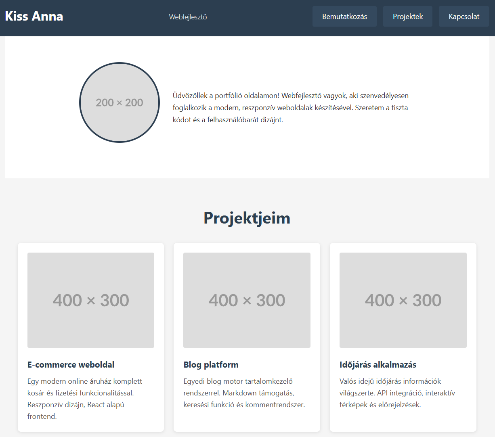

# Reszponzív portfólió oldal

## Célkitűzés
Egy egyszerű, reszponzív portfólió oldal elkészítése, amely mobilon egyoszlopos, tableten kétoszlopos, asztali nézetben pedig háromoszlopos elrendezést használ. A feladat során gyakorolhatod a mobile-first megközelítést, a Flexbox használatát és a media query-k alkalmazását.



>[!NOTE]
>**Ne feledd:** A cél a tanulás és a gyakorlás. Az oldal nem kell pixel-pontosan hasonlítson a referenciára, a lényeg az alapelvek helyes alkalmazása.

## Kiindulási fájlok
Töltsd le a `portfolio_alap.html` fájlt a Moodle-ről! Ez tartalmazza az oldal HTML vázát, de még nincsenek rajta osztálynevek és formázások.

## 1. Alapbeállítások és reset (Mobile First)

### 1.1 Univerzális reset
Kezdd a CSS fájl létrehozásával! Az első szabály legyen az univerzális selektor, amely:
- Nullázza az összes elem margóját és paddingját
- Beállítja a box-sizing tulajdonságot, hogy a padding és border ne növelje meg az elemek teljes szélességét

### 1.2 Body alapstílusok
A body elem számára állíts be:
- Egy jól olvasható, modern betűtípust (sans-serif családból)
- Megfelelő sortávolságot az olvashatóság érdekében (nagyobb, mint az alapértelmezett 1)
- Semleges, világos háttérszínt
- Sötét szövegszínt a jó kontraszthoz

>[!NOTE]
>**Mobile First koncepció:** Először a legkisebb képernyőmérethez (mobilhoz) írjuk meg a stílusokat, majd media query-kkel fokozatosan bővítjük nagyobb képernyőkhöz. Ez biztosítja, hogy minden eszközön működjön az oldal.

## 2. Header elkészítése

### 2.1 Header konténer
A header elem formázása:
- Add meg a háttérszínét (válassz egy jellegzetes, sötétebb tónust)
- Állíts be elegendő belső térközt minden irányban, hogy levegős legyen
- Világos színű szöveg, hogy ellentétben álljon a sötét háttérrel

### 2.2 Név és szerepkör formázása
A header-en belüli címsor (h1):
- Nagyobb betűméret
- Minimális vagy nulla margó minden irányban
- Esetleg csökkentett sortávolság, ha többsoros

A második szintű címsor (h2), ami a szakmát/szerepkört jelzi:
- Kisebb betűméret, mint a név
- Vékonyabb betűvastagság
- Esetleg egy halványabb színárnyalat

### 2.3 Navigáció mobilon
A nav elemen belüli lista formázása:
- Távolítsd el az alapértelmezett listajelölést
- Távolítsd el a padding és margin értékeket

A navigációs linkek:
- Blokk szintű megjelenítés (így egymás alatt lesznek mobilon)
- Távolítsd el az aláhúzást
- Adj hozzá belső térközt a könnyebb kattinthatóság érdekében
- Egyértelmű szín, ami illik a témához
- Opcionális: hover effekt színváltással

## 3. Bemutatkozó szekció (hero/intro)

### 3.1 Intro konténer
A bemutatkozó szekció formázása:
- Jelentős felső és alsó belső térköz
- Középre igazított szöveg
- Esetleg eltérő háttérszín vagy kép a vizuális hierarchia érdekében

### 3.2 Profil kép
Az intro-ban található kép:
- Kör alakú (használd a border-radius tulajdonságot)
- Korlátozott maximális szélesség, hogy ne legyen túl nagy mobilon
- Automatikus magasság az arány megtartásához
- Esetleg vékony szegély

### 3.3 Bemutatkozó szöveg
A szekción belüli bekezdés:
- Valamivel nagyobb betűméret az olvashatóság érdekében
- Megfelelő margó felül-alul

## 4. Projektek szekció (Flexbox használata)

### 4.1 Projektek konténer (mobil nézet)
A projektek főkonténere:
- Megfelelő belső térköz minden irányban
- Opcionális háttérszín vagy szegély

>[!NOTE]
>Mobilon még NEM használunk Flexbox-ot, az elemek maradjanak egyszerű blokk elrendezésben egymás alatt!

### 4.2 Projekt grid wrapper
**Először:** Adj egy osztályt annak a div-nek, amely közvetlenül tartalmazza a projekt kártyákat (pl. `project-grid` vagy hasonló).

### 4.3 Egyedi projekt kártya
Minden projekt kártyához (div vagy article elem) adj egy közös osztályt.

Erre az osztályra írd meg:
- Háttérszín (világos, semleges)
- Belső térköz minden irányban
- Alsó margó (hogy térköz legyen a kártyák között)
- Opcionális: lekerekített sarkok
- Opcionális: finom árnyék a mélység érzékeléséhez

### 4.4 Projekt tartalom
A projekt kártyán belüli elemek:
- A projektkép legyen teljes szélességű a kártyán belül
- Automatikus magasság
- Kis lekerekítés a sarkokon
- A címsor (h3) legyen hangsúlyos, megfelelő méretű
- A leírás (p) legyen jól olvasható, megfelelő sorközzel

## 5. Kapcsolat szekció

### 5.1 Kapcsolat konténer
A kapcsolat szekció:
- Jelentős belső térköz
- Középre igazított szöveg
- Esetleg eltérő háttérszín

### 5.2 Kapcsolati linkek lista
A kapcsolati linkeket tartalmazó lista:
- Nincs listajelölés
- Nincs padding
- Az elemek egymás alatt mobilon

Minden lista elem:
- Alsó margó az elemek szeparálásához

A linkek:
- Nincs aláhúzás
- Kifejező szín
- Blokk szintű megjelenítés
- Belső térköz a kattinthatóság növelésére
- Hover effekt

## 6. Footer

A footer elem:
- Középre igazított szöveg
- Belső térköz minden irányban
- Halványabb szövegszín
- Kisebb betűméret
- Opcionális: háttérszín vagy felső szegély

## 7. Első media query - Tablet nézet

### 7.1 Töréspont meghatározása
Most hozzáadunk egy media query-t, amely akkor lép életbe, amikor a viewport eléri vagy meghaladja a tablet méretet.

>[!NOTE]
>**Tipp:** Használj em vagy rem egységeket a töréspontokhoz! Egy jó kiindulási pont tablet nézethez kb. 40-48em (~640-768px, ha az alap betűméret 16px).

**Példa szerkezet:**
```css
@media (min-width: [válassz egy em értéket]) {
    /* Tablet stílusok */
}
```

### 7.2 Navigáció átrendezése
A tablet nézettől kezdve a navigáció legyen vízszintes:
- A nav elemen állítsd be a Flexbox konténert
- Az elemek legyenek sorban (ez az alapértelmezett, de explicit kiírhatod)
- Adj térközt az elemek közé (használd a gap tulajdonságot)
- Esetleg igazítsd középre vagy a jobb oldalra az elemeket

A navigációs linkek:
- Már nem blokk szintűek
- Megfelelő oldalsó belső térköz

### 7.3 Intro szekció kétoszlopos elrendezése
A bemutatkozó szekcióban használj Flexbox-ot:
- Az intro konténer legyen flex konténer
- Állítsd be, hogy az elemek középre legyenek igazítva mindkét tengelyen
- Esetleg változtasd meg a flex-direction-t, ha szükséges
- A profil kép és a szöveg közé adj térközt

### 7.4 Projektek kétoszlopos grid
Most aktiváljuk a Flexbox-ot a projekt kártyákhoz!

A project-grid osztályú elemre:
- Állítsd be Flexbox konténernek
- Engedélyezd a sortörést (wrap)
- Adj térközt az elemek közé (gap tulajdonság)

Az egyedi projekt kártyák:
- Állítsd be a flex tulajdonságot úgy, hogy kb. fele akkora szélesek legyenek, mint a konténer
- **Tipp:** Ha a gap miatt nem fér ki két kártya egymás mellé, csökkentsd a flex-basis értéket (pl. 45% vagy használj calc() függvényt)
- Vedd ki az alsó margót (a gap kezeli a térközt)

>[!NOTE]
>**Flexbox vs margó:** Amikor Flexbox gap-et használsz, ne használj margót az elemek szeparálására, mert duplikálódik a térköz!

### 7.5 Kapcsolati linkek sorba rendezése
A kapcsolat szekció listája:
- Flexbox konténer
- Középre igazítva
- Térköz az elemek között

## 8. Második media query - Desktop nézet

### 8.1 Desktop töréspont
Adj hozzá egy újabb media query-t nagyobb képernyőkhöz (kb. 60-64em, ~960-1024px).

### 8.2 Szélesség korlátozás
Több konténer számára (header konténer, intro, projektek, kapcsolat) adj meg:
- Maximális szélességet (hogy széles képernyőn ne legyen túl széthúzva a tartalom)
- Automatikus margót oldalt (középre igazítás)

### 8.3 Navigáció finomhangolása
A navigáció desktop nézetben:
- Esetleg a header-en belül Flexbox-szal rendezd át, hogy a név balra, a nav jobbra kerüljön
- Vagy használd a space-between igazítást

### 8.4 Projektek háromoszlopos grid
A project-grid-nél:
- Módosítsd a projekt kártyák flex értékét úgy, hogy kb. harmad akkora szélesek legyenek
- **Tipp:** 33.333% vagy calc() függvény használata a gap figyelembevételével

### 8.5 Intro szekció finomítása
Az intro szekció desktop nézetben:
- Növeld a profil kép méretét
- Esetleg változtasd meg az elrendezést (kép és szöveg egymás mellett)
- Növeld a betűméreteket

### 8.6 Általános finomítások
Desktop nézetben:
- Növeld a fő betűméretet
- Növeld a padding/margin értékeket (levegősebb megjelenés)
- Finomhangold a címek méretét

## 9. Speciális media query-k (opcionális)

### 9.1 Tájolás kezelése
Adj hozzá egy media query-t, amely reagál a tájolásra:
- Tablet álló nézetben (portrait) maradjanak a kártyák kétoszloposak
- Tablet fekvő nézetben (landscape) már lehessenek háromoszloposak

**Példa szerkezet:**
```css
@media (orientation: landscape) and (min-width: [tablet em érték]) and (max-width: [desktop em érték előtti érték]) {
    /* Landscape specifikus stílusok */
}
```

### 9.2 Hover támogatás detektálása
Adj hozzá finomabb hover effekteket azoknak, akiknek van hover képességük (egér):

```css
@media (hover: hover) {
    /* Hover effektek */
}
```

Ebben írhatod meg:
- Projekt kártyák hover állapotát (árnyék növelése, felemelés)
- Navigációs linkek animált átmenetét
- Stb.

## 10. Nyomtatási nézet (opcionális)

Adj hozzá egy @media print szabályt:
- Rejts el elemeket, amelyek nem kellenek nyomtatáskor (navigáció, kapcsolat linkek)
- Állítsd át a háttérszíneket semlegesre
- Optimalizáld a betűméreteket
- Kerüld az oldaltöréseket a projekt kártyákon belül

## Ellenőrzési lista

**Alapok:**
- [ ] Van univerzális reset (*-os szabály)?
- [ ] A body alapstílusai megfelelőek?
- [ ] Mobile-first megközelítést követted?

**Header:**
- [ ] A header formázott, van háttérszín és térköz?
- [ ] A név és szerepkör jól látható?
- [ ] A navigáció mobilon függőlegesen rendezett?

**Intro:**
- [ ] A profil kép kör alakú?
- [ ] A szekció középre igazított?
- [ ] Megfelelő térköz van az elemek között?

**Projektek:**
- [ ] Van külön osztály a projekt grid-nek és a kártyáknak?
- [ ] A kártyák mobilon egymás alatt vannak?
- [ ] A kártyák stílusosak (háttér, padding, árnyék)?

**Kapcsolat és Footer:**
- [ ] A kapcsolat szekció formázott?
- [ ] A footer megfelelően néz ki?

**Tablet nézet (első media query):**
- [ ] A navigáció vízszintesen rendezett Flexbox-szal?
- [ ] A projekt kártyák kétoszloposak?
- [ ] Flexbox gap-et használsz margó helyett?

**Desktop nézet (második media query):**
- [ ] Van maximális szélesség korlátozás?
- [ ] A projekt kártyák háromoszloposak?
- [ ] A betűméretek és térközök nagyobbak?

**Extra pontok:**
- [ ] Van tájolás-specifikus media query?
- [ ] Van hover-specifikus media query?
- [ ] Van nyomtatási nézet?

## Tippek és gyakori hibák

### Flexbox gap vs margó
❌ **Rossz:**
```css
.project-grid {
    display: flex;
    flex-wrap: wrap;
}
.project-card {
    margin: 10px; /* Ez duplázza a térközt */
}
```

✅ **Jó:**
```css
.project-grid {
    display: flex;
    flex-wrap: wrap;
    gap: 20px; /* Egy helyen kezeld a térközt */
}
.project-card {
    /* Nincs margó */
}
```

### Flex méretezés számítása
Ha 2 oszlopot szeretnél gap-pel:
```css
.project-card {
    flex: 1 1 calc(50% - 10px); /* Ha a gap 20px, akkor oszd ketté */
}
```

Vagy egyszerűbben:
```css
.project-card {
    flex: 1 1 45%; /* Kisebb érték, ami biztosan elfér */
}
```

### Media query sorrend
Mindig növekvő sorrendben írd a töréspontokat:
```css
/* Mobil (alap, nincs media query) */

@media (min-width: 48em) {
    /* Tablet */
}

@media (min-width: 64em) {
    /* Desktop */
}
```

## Megoldás feltöltése
Töltsd fel a kész `portfolio_styled.html` és `style.css` fájlokat a Moodle-re!

>[!TIP]
>**Tesztelés:** A böngésző fejlesztői eszközeivel (F12) változtasd a viewport méretét és figyeld meg, hogy az oldal hogyan adaptálódik a különböző képernyőméretekhez!