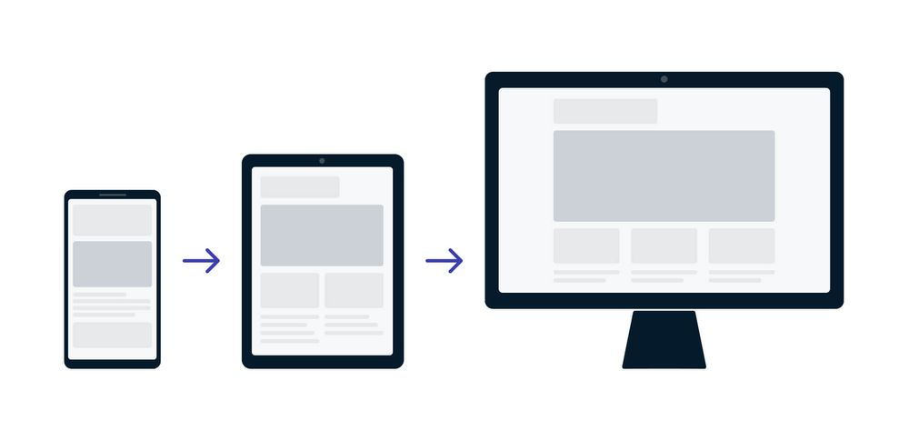

# Bevezetés a Reszponzív Webdesignba

## Mi az a Reszponzív Webdesign (RWD)?

A reszponzív webdesign (RWD) **nem egy különálló technológia, hanem egy tervezési megközelítés** és a legjobb gyakorlatok összessége. Az RWD célja, hogy a weboldalak jól jelenjenek meg és **jó használhatóságot biztosítsanak minden képernyőméreten és felbontáson**.

Az RWD lényege, hogy a weboldal **HTML és CSS használatával automatikusan átméreteződjön**, elrejtőzzön, zsugorodjon vagy megnagyobbodjon, hogy **optimális megjelenést és felhasználói élményt** nyújtson minden böngészésre alkalmas eszközön (asztali gép, táblagép, telefon, TV, stb.).

A weboldal rugalmasan alkalmazkodik a különböző böngészők képernyőjének méretéhez. Ez a megközelítés magában foglalja a **fluid rácsok, fluid képek és a Media Query-k** alkalmazását reszponzív tartalom létrehozásához. A modern CSS elrendezési módszerek, mint a Flexbox és a CSS Grid, eleve reszponzívak.

## Az RWD jelentősége és előnyei

A reszponzív webdesignra való áttérés jelentősége 2015 áprilisában nőtt meg különösen, amikor a Google megváltoztatta a rangsorolási algoritmusát, előnyben részesítve a mobilbarát weboldalakat, ami a „mobilgeddon” néven vált ismertté.

Az RWD alkalmazása előnyös a felhasználók szempontjából is, mivel egyre nagyobb az igény a mobilbarát weboldalakra.

**Az RWD fő előnyei a különálló mobilos/desktopos verziókkal szemben:**

1.  **Keresőoptimalizálás (SEO):** A Google előrébb sorolja a reszponzív oldalakat a keresési eredményekben.
2.  **Felhasználói metrikák:** Csökken a visszapattanási arány (bounce rate).
3.  **Teljesítmény:** Gyorsabb lesz az oldal, mivel nincs szükség átirányításokra a különböző verziók között.
4.  **Fejlesztési hatékonyság:** Könnyebb fejleszteni és karbantartani, mivel csak egy helyen kell módosítani a kódot.
5.  **Jövőállóság:** A megoldás felkészül a jövőben megjelenő, ma még nem létező eszközökre is (pl. okosóra, hajlítható mobiltelefon, phablet, VR szemüveg).
6.  **Felhasználói élmény:** A navigáció és az olvasás nem válik nehézkessé, az oldalsó oszlopok fokozatosan kerülnek egymás alá a képernyőméret függvényében.

## A "Mobile First" megközelítés

A **"Mobile First"** egy tervezési stratégia és egyben az egyik leggyakoribb megközelítés a reszponzív webdesignban.



**A megközelítés lényege és okai:**

1.  **Tervezési sorrend:** Először a mobil nézetet készítjük el, majd ezután a desktoposat és a többit.
2.  **Korlátozások kezelése:** A Mobile First megoldás mellett szól az az ok, hogy a mobil verzió esetében kell szembesülni a kis képernyőméret miatti legnagyobb korlátozásokkal. Az ebből való kiindulás előnyösebb, mintha egy komplex asztali dizájnt próbálnánk zsugorítani.
3.  **Kiindulási alap:** A legkisebb (pl. 320 pixel) töréspontból érdemes kiindulni, és onnan haladni "felfelé" (pl. 2000 pixel).
4.  **Egyszerűség:** A legkisebb eszközök nézete gyakran egyszerű, **egyoszlopos tartalom**, ami a normál áramlásban (normal flow) jelenik meg, így kevés layout beállítást igényel. Ez azt jelenti, hogy kezdetben viszonylag kevés layout CSS-re van szükség, mivel a HTML forráskód sorrendje biztosítja a tartalmi érthetőséget.

A Media Query-kkel ezután tudunk elrendezési szabályokat adni hozzá, ahogy a nézőkép szélesedik (például két- vagy háromoszlopos elrendezéseket hozva létre).

A reszponzív webdesign egyik alapkövetelménye, hogy a böngésző pontosan tudja, milyen méretű területen dolgozunk, és hogy az elemek méretezése ne fix, hanem relatív (folyékony) legyen. Ezt a fejezet három fő technikai alapkövét tárgyalja.

## A Viewport beállítása

A `viewport` **a weboldal felhasználó által látható területe**. Ennek mérete különböző kijelzőméreteknél változik.

A reszponzív weboldalak alapvető feltétele, hogy a HTML dokumentum `<head>` részében **mindig** szerepeljen a **Viewport meta tag**. A Viewport egy **HTML5-ben bevezetett meta elem**, amelyet az alábbi formában kell beállítani:

```html
<meta name="viewport" content="width=device-width, initial-scale=1.0" />
```
Ez a beállítás két fontos dolgot közöl a mobil böngészővel:

1.  **`width=device-width`**: A weboldal `width` tulajdonsága kövesse a kijelző szélességét.
2.  **`initial-scale=1.0`**: Meghatározza, hogy az oldal **mekkora nagyítást (zoomot) használjon** az első betöltéskor. Ez segít a betűk konzisztens méretének biztosításában,.

>[!NOTE]
>A Viewport meta tag azért elengedhetetlen, mert a mobil böngészők történelmileg hajlamosak voltak „hazudni” a viewport szélességéről (pl. 980 pixelt állítottak be), majd a teljes oldalt lekicsinyítették. Ez a meta tag **felülírja ezt az alapértelmezett viselkedést**, biztosítva, hogy a mobil böngésző az **oldalt mobilképesnek érzékelje**, és ne a teljes verziót próbálja meg összenyomni,. Enélkül a reszponzív kialakítás (a töréspontok és média lekérdezések) nem működhetnek megfelelően a mobil böngészőkben.