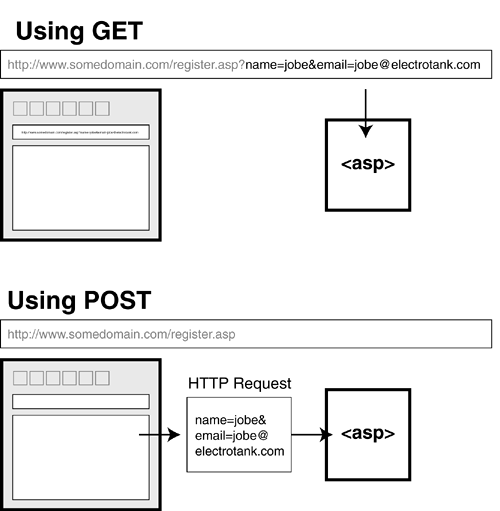

# Űrlapok kezelése: HTTP Metódusok és Validáció

A mai leckében folytatjuk a Javascript megismerését. A korábbiakban megtanultuk, hogyan kezeljünk kliens oldalon adatokat (objektumok), amelyeket egy tömbben tárolunk. Most a kliens-szerver közötti kommunikációval fogunk foglalkozni. A weben több fajta technológia is rendelkezésre áll, amelyek segítségével kommunikáció végezhető résztvevők között, mi a HTTP protokollra fogunk fókuszálni.

## Kliens, Szerver és a Kérés

Első lépésként tisztázzuk, hogy 

  * **Kliens:** A böngésző, ahol kitöltöd az űrlapot.
  * **Szerver:** A távoli gép, ami várja az adatokat.
  * **HTTP Protokoll:** A "nyelv", amin beszélgetnek.

Amikor rányomsz a "Küldés" gombra, a böngésző egy **HTTP Kérést (Request)** csomagol össze. De nem mindegy, *hogyan* csomagolja! Itt jön képbe a két legfontosabb metódus: a **GET** és a **POST**.



### GET vs. POST: Mi a különbség?

Képzeld el, hogy levelet küldesz.

  * **GET (A Képeslap):**

      * **Nyílt lap:** Mindenki látja, mi van ráírva.
      * **URL-ben utazik:** Az adatok a webcím végére kerülnek (pl. `kereses.php?kulcsszo=cipő`).
      * **Mire jó?** Kereséshez, szűréshez, olyan adatokhoz, amik nem titkosak. Könyvjelzőzhető!
      * **Mire NEM jó?** Jelszavakhoz (látszik az előzményekben!), túl sok adathoz.

  * **POST (A Lezárt Boríték):**

      * **Rejtett tartalom:** Az adat a kérés "testében" (body) utazik, nem a címzésben.
      * **Nincs az URL-ben:** A címsor tiszta marad.
      * **Mire jó?** Regisztrációhoz, bejelentkezéshez, nagy mennyiségű szöveg küldéséhez.
      * **Mire NEM jó?** Nem lehet könyvjelzőzni az eredményt.

### Összehasonlító táblázat

| Tulajdonság | GET | POST |
| :--- | :--- | :--- |
| **Adatok helye** | Az URL-ben (`?nev=ertek`) | A kérés testében (Request Body) |
| **Láthatóság** | **Mindenki látja** a címsorban | Rejtett (átlagfelhasználó számára) |
| **Adatmennyiség** | Korlátozott (max pár ezer karakter) | Szinte korlátlan |
| **Gyorsítótár (Cache)** | A böngésző elmentheti | Nem mentődik el automatikusan |
| **Tipikus használat** | Keresés, adatlekérés | Bejelentkezés, mentés, rendelés |

>[!WARNING]
>Soha ne használj **GET** metódust jelszavak vagy bankkártya adatok küldésére! Bárki, aki ránéz a monitorodra vagy a böngészési előzményeidre, látni fogja a jelszót.

## Az űrlap felépítése

A HTML-ben a `<form>` elem attribútumaival szabályozzuk, hova és hogyan menjen az adat.

  * `action`: **Hova?** A szerver címe (URL), ami feldolgozza az adatot.
  * `method`: **Hogyan?** Itt adjuk meg, hogy `GET` vagy `POST`.

```html
<!-- Példa egy biztonságosabb, adatküldő űrlapra -->
<form id="loginForm" action="https://httpbin.org/post" method="POST">
    
    <label for="user">Felhasználónév:</label>
    <input type="text" id="user" name="username">

    <label for="pass">Jelszó:</label>
    <input type="password" id="pass" name="password">

    <button type="submit">Belépés</button>
</form>
```

## HTML Beviteli Mezők

A HTML űrlapok lelke az `<input>` elem. Azt, hogy hogyan néz ki és hogyan viselkedik, a `type="..."` attribútum határozza meg.

### Szöveges beviteli mezők

Ezek a leggyakoribbak. Mindegyiknél az `elem.value` adja vissza a beírt szöveget stringként.

#### `type="text"` (Egysoros szöveg)

A legáltalánosabb mező. Nincs benne extra logika, bármit elfogad.

  * **Használat:** Név, felhasználónév, cím, tárgy.
  * **HTML:** `<input type="text" placeholder="Pl. Kovács Béla">`

#### `type="password"` (Jelszó)

Ugyanaz, mint a text, de a karaktereket elrejti (általában pöttyökkel).

  * **Használat:** Jelszavak, PIN kódok.
  * **Fontos:** Ez csak vizuális védelem\! A hálózaton titkosítás nélkül (HTTPS) ugyanúgy látható lenne.
  * **HTML:** `<input type="password">`

#### `type="email"` (Email cím)

Mobiltelefonon megnyitja a `@` jelet tartalmazó billentyűzetet. Alapvető formai ellenőrzést végez (pl. kell bele @ jel).

  * **Használat:** Email címek.
  * **HTML:** `<input type="email">`

#### `<textarea>` (Többsoros szöveg)

Ez a kakukktojás, mert ez **nem** `<input>` típus, hanem egy külön HTML tag, de ide tartozik.

  * **Használat:** Üzenetek, megjegyzések, leírások.
  * **HTML:** `<textarea rows="4" cols="50"></textarea>`
  * **JS:** Ugyanúgy `.value`-val olvassuk ki.

### Számok és Dátumok

#### `type="number"` (Szám)

Csak számokat enged beírni. Mobilon megnyitja a számbillentyűzetet.

  * **Extrák:** `min`, `max` (korlátok), `step` (lépésköz).
  * **HTML:** `<input type="number" min="1" max="100">`
  * **JS:** `.value`-t ad vissza (ami string\!), ha számként kell, használd a `Number(elem.value)`-t.

#### `type="date"` (Dátumválasztó)

Megjelenít egy naptárat (date picker).

  * **Használat:** Születésnap, foglalási időpont.
  * **HTML:** `<input type="date">`
  * **JS:** A dátumot `YYYY-MM-DD` formátumú stringként adja vissza (pl. "2023-10-27").

### Kiválasztók (Choice Inputs)

Itt trükkösebb a JavaScript, mert nem mindig a `.value` a lényeg.

#### `type="checkbox"` (Jelölőnégyzet)

Kétállapotú kapcsoló: vagy be van pipálva, vagy nincs.

  * **Használat:** "Elfogadom a feltételeket", "Hírlevél feliratkozás".
  * **HTML:** `<input type="checkbox" id="aszf"> <label for="aszf">Elfogadom</label>`
  * **JS:** **Fontos\!** Itt nem a `.value`-t nézzük, hanem a `.checked` tulajdonságot, ami `true` vagy `false`.
    ```javascript
    if (document.getElementById('aszf').checked) { ... }
    ```

#### `type="radio"` (Rádiógomb)

Amikor **több opcióból csak EGYET** lehet választani.

  * **Működés:** A csoportosítást a `name` attribútum végzi. Amelyiknek ugyanaz a neve, azok tartoznak egy csoportba.
  * **Használat:** Nem/Igen, Fizetési mód választás.
  * **HTML:**
    ```html
    <input type="radio" name="nem" value="ferfi"> Férfi
    <input type="radio" name="nem" value="no"> Nő
    ```
  * **JS:** Azt kell megkeresni, amelyik `.checked` tulajdonsága igaz.

#### `<select>` (Legördülő lista / Dropdown)

Helytakarékos megoldás sok opció esetén.

  * **HTML:**
    ```html
    <select id="varos">
      <option value="bp">Budapest</option>
      <option value="db">Debrecen</option>
    </select>
    ```
  * **JS:** `document.getElementById('varos').value` visszaadja a kiválasztott `option` *value* értékét (pl. "bp").

### Speciális Inputok

#### `type="file"` (Fájlfeltöltés)

Lehetővé teszi fájlok kiválasztását a számítógépről.

  * **HTML:** `<input type="file" accept="image/png, image/jpeg">`
  * **JS:** Itt a `.files` tömböt használjuk a `.value` helyett a fájl adatainak eléréséhez.

#### `type="hidden"` (Rejtett mező)

A felhasználó számára láthatatlan, de az űrlap elküldésekor az adat utazik a szerverre.

  * **Használat:** Azonosítók (ID), biztonsági tokenek küldése.
  * **HTML:** `<input type="hidden" name="userId" value="12345">`

### Összefoglaló Referencia Táblázat

| Típus (`type="..."`) | Mire jó? | JS érték lekérése | JS ellenőrzés példa |
| :--- | :--- | :--- | :--- |
| `text` | Általános szöveg | `.value` | `.value === ""` |
| `password` | Titkosított szöveg | `.value` | `.value.length < 8` |
| `email` | Email cím | `.value` | `.validity.valid` |
| `number` | Számok | `.value` | `Number(elem.value) > 18` |
| `checkbox` | Igen/Nem kapcsoló | **`.checked`** | `!elem.checked` |
| `radio` | Választás listából | **`.checked`** | (a csoportot kell vizsgálni) |
| `date` | Dátum | `.value` | (string összehasonlítás) |
| `<select>` | Legördülő lista | `.value` | `.value === "valasztas"` |

## JavaScript Validáció és Beküldés

A JavaScript feladata a "kapuőr" szerep. Megvizsgálja a boríték tartalmát, mielőtt a postás (a böngésző) elvinné.

### A logika lépései:

1.  **Eseményfigyelés:** A `submit` esemény elkapása.
2.  **Validáció:** Ellenőrizzük, hogy a mezők megfelelően vannak-e kitöltve.
3.  **Döntés (Control Flow):**
      * **Ha hiba van:** `event.preventDefault()` -\> Megállítjuk a folyamatot, és hibaüzenetet adunk.
      * **Ha minden oké:** *Nem* hívjuk meg a preventDefault-ot. Hagyjuk, hogy a HTML `method="POST"` beállítása érvényesüljön, és az adatok elinduljanak a szerver felé.

### Gyakorlati Példa (Teljes kód)

Ez a kód egy bejelentkezést szimulál. Ha helyesek az adatok, elküldi őket a `httpbin.org`-ra, ahol láthatod, hogy `POST` kéréssel érkeztek meg.

```html
<!DOCTYPE html>
<html lang="hu">
<head>
    <meta charset="UTF-8">
    <meta name="viewport" content="width=device-width, initial-scale=1.0">
    <title>Mindent Bele Űrlap - Validációval</title>
    <style>
        body { font-family: 'Segoe UI', Tahoma, Geneva, Verdana, sans-serif; background-color: #f4f4f9; padding: 20px; display: flex; justify-content: center; }
        .container { background: white; padding: 30px; border-radius: 8px; box-shadow: 0 4px 15px rgba(0,0,0,0.1); max-width: 600px; width: 100%; }
        h1 { text-align: center; color: #333; }
        p.info { font-size: 0.9em; color: #666; text-align: center; margin-bottom: 20px; }
        
        .form-group { margin-bottom: 20px; }
        label { display: block; margin-bottom: 8px; font-weight: bold; color: #555; }
        
        /* Input stílusok */
        input[type="text"], input[type="email"], input[type="password"], 
        input[type="number"], input[type="date"], select, textarea, input[type="file"] {
            width: 100%;
            padding: 10px;
            border: 1px solid #ccc;
            border-radius: 4px;
            box-sizing: border-box; /* Hogy a padding ne növelje a szélességet */
            font-size: 16px;
        }

        /* Checkbox és Radio stílusok */
        .radio-group label, .checkbox-group label { display: inline; font-weight: normal; margin-right: 15px; }
        input[type="radio"], input[type="checkbox"] { transform: scale(1.2); margin-right: 5px; }

        /* Gomb stílus */
        button { width: 100%; padding: 12px; background-color: #28a745; color: white; border: none; border-radius: 4px; cursor: pointer; font-size: 16px; font-weight: bold; transition: background 0.3s; }
        button:hover { background-color: #218838; }

        /* Hibaüzenetek */
        .error-msg { color: #dc3545; font-size: 0.85em; margin-top: 5px; height: 1.2em; }
        
        /* Sikeres validáció jelzésére (opcionális) */
        input.input-error { border-color: #dc3545; background-color: #fff8f8; }
    </style>
</head>
<body>

<div class="container">
    <h1>Regisztrációs Űrlap</h1>
    <p class="info">Töltsd ki az adatokat! A "Küldés" gomb után a httpbin.org jeleníti meg a szerverre érkezett adatokat.</p>

    <!-- 
        enctype="multipart/form-data": Ez kötelező, ha fájlt is küldünk!
        A httpbin a fájlokat a "files", az adatokat a "form" részben mutatja majd.
    -->
    <form id="fullForm" action="https://httpbin.org/post" method="POST" enctype="multipart/form-data">
        
        <!-- REJTETT MEZŐ (Pl. felhasználó azonosító) -->
        <input type="hidden" name="user_id" value="UID_998877">

        <!-- 1. SZÖVEG -->
        <div class="form-group">
            <label for="fullname">Teljes név:</label>
            <input type="text" id="fullname" name="fullname" placeholder="Pl. Kiss Anna">
            <div id="error-name" class="error-msg"></div>
        </div>

        <!-- 2. EMAIL -->
        <div class="form-group">
            <label for="email">Email cím:</label>
            <input type="email" id="email" name="email" placeholder="pelda@mail.com">
            <div id="error-email" class="error-msg"></div>
        </div>

        <!-- 3. JELSZÓ -->
        <div class="form-group">
            <label for="password">Jelszó (min. 6 karakter):</label>
            <input type="password" id="password" name="password">
            <div id="error-pass" class="error-msg"></div>
        </div>

        <!-- 4. DÁTUM és 5. SZÁM -->
        <div style="display: flex; gap: 15px;">
            <div class="form-group" style="flex: 1;">
                <label for="birthdate">Születési dátum:</label>
                <input type="date" id="birthdate" name="birthdate">
                <div id="error-date" class="error-msg"></div>
            </div>
            <div class="form-group" style="flex: 1;">
                <label for="age">Életkor (18+):</label>
                <input type="number" id="age" name="age" min="1">
                <div id="error-age" class="error-msg"></div>
            </div>
        </div>

        <!-- 6. RÁDIÓ GOMBOK (Csak egy választható) -->
        <div class="form-group radio-group">
            <label style="display:block; margin-bottom:10px;">Nem:</label>
            <input type="radio" id="female" name="gender" value="no" checked>
            <label for="female">Nő</label>
            
            <input type="radio" id="male" name="gender" value="ferfi">
            <label for="male">Férfi</label>

            <input type="radio" id="other" name="gender" value="egyeb">
            <label for="other">Egyéb</label>
        </div>

        <!-- 7. SELECT (Legördülő) -->
        <div class="form-group">
            <label for="position">Munkakör:</label>
            <select id="position" name="job_position">
                <option value="">-- Válassz egyet --</option>
                <option value="developer">Fejlesztő</option>
                <option value="designer">Designer</option>
                <option value="manager">Menedzser</option>
            </select>
            <div id="error-job" class="error-msg"></div>
        </div>

        <!-- 8. FÁJL FELTÖLTÉS -->
        <div class="form-group">
            <label for="profile_pic">Profilkép feltöltése:</label>
            <input type="file" id="profile_pic" name="profile_pic" accept="image/*">
        </div>

        <!-- 9. TEXTAREA (Hosszú szöveg) -->
        <div class="form-group">
            <label for="bio">Rövid bemutatkozás:</label>
            <textarea id="bio" name="bio" rows="4" placeholder="Írj magadról pár mondatot..."></textarea>
        </div>

        <!-- 10. CHECKBOX (Jelölőnégyzet) -->
        <div class="form-group checkbox-group">
            <input type="checkbox" id="terms" name="terms_accepted">
            <label for="terms">Elfogadom az Adatvédelmi Nyilatkozatot *</label>
            <div id="error-terms" class="error-msg"></div>
        </div>

        <button type="submit">Regisztráció Küldése</button>
    </form>
</div>

<script>
    const form = document.getElementById('fullForm');
    
    // Elemek referenciái
    const nameInput = document.getElementById('fullname');
    const passInput = document.getElementById('password');
    const ageInput = document.getElementById('age');
    const jobInput = document.getElementById('position');
    const termsInput = document.getElementById('terms'); // Checkbox

    // Hibaüzenet tárolók
    const errorName = document.getElementById('error-name');
    const errorPass = document.getElementById('error-pass');
    const errorAge = document.getElementById('error-age');
    const errorJob = document.getElementById('error-job');
    const errorTerms = document.getElementById('error-terms');

    form.addEventListener('submit', function(event) {
        let isValid = true;

        // 1. Töröljük az előző hibaüzeneteket és stílusokat
        const errors = document.querySelectorAll('.error-msg');
        errors.forEach(el => el.textContent = '');
        const inputs = document.querySelectorAll('input, select');
        inputs.forEach(el => el.classList.remove('input-error'));

        // --- VALIDÁCIÓK ---

        // Név ellenőrzése (nem lehet üres)
        if (nameInput.value.trim() === "") {
            errorName.textContent = "A név megadása kötelező!";
            nameInput.classList.add('input-error');
            isValid = false;
        }

        // Jelszó hossza (min 6)
        if (passInput.value.length < 6) {
            errorPass.textContent = "A jelszó túl rövid (min. 6 karakter).";
            passInput.classList.add('input-error');
            isValid = false;
        }

        // Életkor vizsgálat (számmá alakítás és értékvizsgálat)
        // Megj: a HTML type="number" már korlátoz, de JS-ben is érdemes csekkolni
        if (Number(ageInput.value) < 18) {
            errorAge.textContent = "Csak 18 éven felüliek regisztrálhatnak.";
            ageInput.classList.add('input-error');
            isValid = false;
        }

        // Select ellenőrzése (választott-e valamit?)
        if (jobInput.value === "") {
            errorJob.textContent = "Kérlek válassz munkakört!";
            jobInput.classList.add('input-error');
            isValid = false;
        }

        // Checkbox ellenőrzése (kötelező pipa) - .checked tulajdonság!
        if (!termsInput.checked) {
            errorTerms.textContent = "A regisztrációhoz el kell fogadnod a feltételeket.";
            isValid = false;
        }

        // --- DÖNTÉS ---
        
        if (!isValid) {
            event.preventDefault(); // Megállítjuk a küldést, ha hiba van
            console.log("Hiba az űrlapon!");
        } else {
            // Ha minden OK, engedjük tovább a httpbin-re
            console.log("Minden adat rendben, küldés...");
        }
    });
</script>

</body>
</html>
```