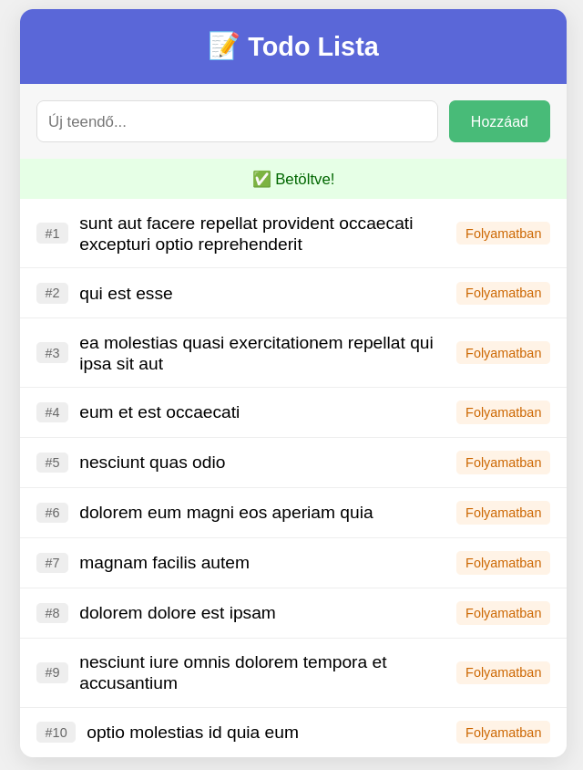

# AJAX és a Fetch API – Szerverkommunikáció JavaScriptben

## Bevezetés: Miért van erre szükség?

Az előző leckében megtanultuk, hogyan küldjük el az űrlapokat a szerverre. De mi történik ilyenkor? **Az egész oldal újratöltődik!** 

Gondolj arra, amikor a Facebookon görgetés közben új posztok jelennek meg, vagy amikor a Google már gépelés közben javaslatokat mutat. Ezek a funkciók nem töltik újra az oldalt – ez az **AJAX** lényege.

### Mi az AJAX?

Az AJAX (Asynchronous JavaScript and XML) egy **megközelítés**, ami lehetővé teszi adatok küldését és fogadását a háttérben:

* **Asynchronous (Aszinkron):** A kérés a háttérben fut, nem blokkolja az oldalt.
* **JavaScript:** A böngészőben futó kód küldi és fogadja az adatokat.
* **JSON:** Az adatformátum, amiben a szerver válaszol (régen XML volt, ma JSON).

## A `fetch()` API

A modern JavaScriptben a **`fetch()` függvényt** használjuk szerverkommunikációra, az **`async/await`** szintaxissal.

### Alapszintaxis

```javascript
async function adatokLetoltese() {
    try {
        const response = await fetch(url);    // Várunk a szerver válaszára
        const data = await response.json();   // JSON-né alakítjuk
        console.log(data);                    // Feldolgozzuk az adatokat
    } catch (error) {
        console.error("Hiba:", error);        // Hiba esetén ide kerül
    }
}
```

### Hogyan működik?

1. **`async function`** – Jelzi, hogy a függvény aszinkron műveleteket tartalmaz.
2. **`await fetch(url)`** – Elindít egy kérést és **megvárja** a választ.
3. **`await response.json()`** – A szerver válaszát JSON-né alakítja.
4. **`try/catch`** – Hiba esetén (pl. nincs internet) a `catch` ágba kerül.

## A JSONPlaceholder API

A gyakorlathoz a **JSONPlaceholder** API-t használjuk – ez egy ingyenes, nyilvános "teszt szerver", ami szintetikus adatokat ad vissza.

**Alap URL:** `https://jsonplaceholder.typicode.com`

| Végpont | Mit ad vissza? |
| :--- | :--- |
| `/todos` | Teendők listája |
| `/posts` | Blog bejegyzések |
| `/users` | Felhasználók |

> [!NOTE]
> A JSONPlaceholder egy **szimulált** API. A POST kérések "működnek" (visszaadják a várt választ), de nem módosítják ténylegesen az adatbázist. Ez tökéletes tanuláshoz!


## Gyakorlat: Todo Alkalmazás

Építsünk egy egyszerű teendő-listát, ami:
1. Betölti a teendőket a szerverről (GET)
2. Új teendőt küld a szerverre (POST)



### 1. lépés: HTML váz

```html
<!DOCTYPE html>
<html lang="hu">
<head>
    <meta charset="UTF-8">
    <meta name="viewport" content="width=device-width, initial-scale=1.0">
    <title>Todo App</title>
    <style>
        
    </style>
</head>
<body>

<div class="container">
    <header>
        <h1>📝 Todo Lista</h1>
    </header>

    <!-- Új teendő űrlap -->
    <form class="add-form" id="add-form">
        <input type="text" id="new-todo" placeholder="Új teendő..." required>
        <button type="submit">Hozzáad</button>
    </form>

    <!-- Státusz jelző -->
    <div id="status"></div>

    <!-- Teendők listája -->
    <ul id="todo-list">
        <!-- IDE KERÜLNEK A TEENDŐK -->
    </ul>
</div>

</body>
</html>
```

---

### 2. lépés: Adatok lekérése (GET)

Kérjük le a teendőket a szerverről és jelenítsük meg őket!

```javascript
// API cím
const API_URL = "https://jsonplaceholder.typicode.com/todos";

// DOM elemek
const todoList = document.getElementById("todo-list");
const statusDiv = document.getElementById("status");

// Státusz üzenet megjelenítése
function showStatus(message, type) {

}

// Egy teendő HTML-jének létrehozása
function createTodoHTML(todo) {

}

// Teendők betöltése a szerverről
async function loadTodos() {

}

// Indítás
loadTodos();
```

### 3. lépés: Új teendő küldése (POST)

Most tegyük lehetővé új teendők hozzáadását!

```javascript
// Űrlap elemek
const addForm = document.getElementById("add-form");
const newTodoInput = document.getElementById("new-todo");

// Új teendő küldése a szerverre
async function addTodo(title) {
    
}

// Űrlap beküldése
addForm.addEventListener("submit", function(event) {
    
});
```

#### A POST kérés felépítése

```javascript
const response = await fetch(url, {
    method: "POST",                    // HTTP metódus
    headers: {
        "Content-Type": "application/json"  // JSON-t küldünk
    },
    body: JSON.stringify({             // Az adat JSON stringként
        title: "Bevásárlás",
        completed: false
    })
});
```

> [!WARNING]
> A `body`-ban **mindig** `JSON.stringify()`-t kell használni! A `fetch()` nem tudja automatikusan átalakítani az objektumot.

## Összefoglaló

| Művelet | HTTP metódus | `fetch()` használat |
| :--- | :--- | :--- |
| Adatok lekérése | `GET` | `await fetch(url)` |
| Új adat küldése | `POST` | `await fetch(url, { method: "POST", body: ... })` |

### Az `async/await` működése

```
async function  →  await fetch(url)  →  await response.json()  →  feldolgozás
      ↓                  ↓                      ↓                     ↓
  Aszinkron fv.    Kérés + várakozás       JSON parse          Megjelenítés
```

### Fontos tudnivalók

1. **`async function`** – Jelzi, hogy a függvényben `await`-et használunk.
2. **`await`** – Megvárja, amíg a művelet befejeződik.
3. **`try/catch`** – Hibakezelés (pl. nincs internet).
4. **`event.preventDefault()`** – Megakadályozza az oldal újratöltését.
5. **`JSON.stringify()`** – Objektumot JSON stringgé alakít (POST-nál kötelező).